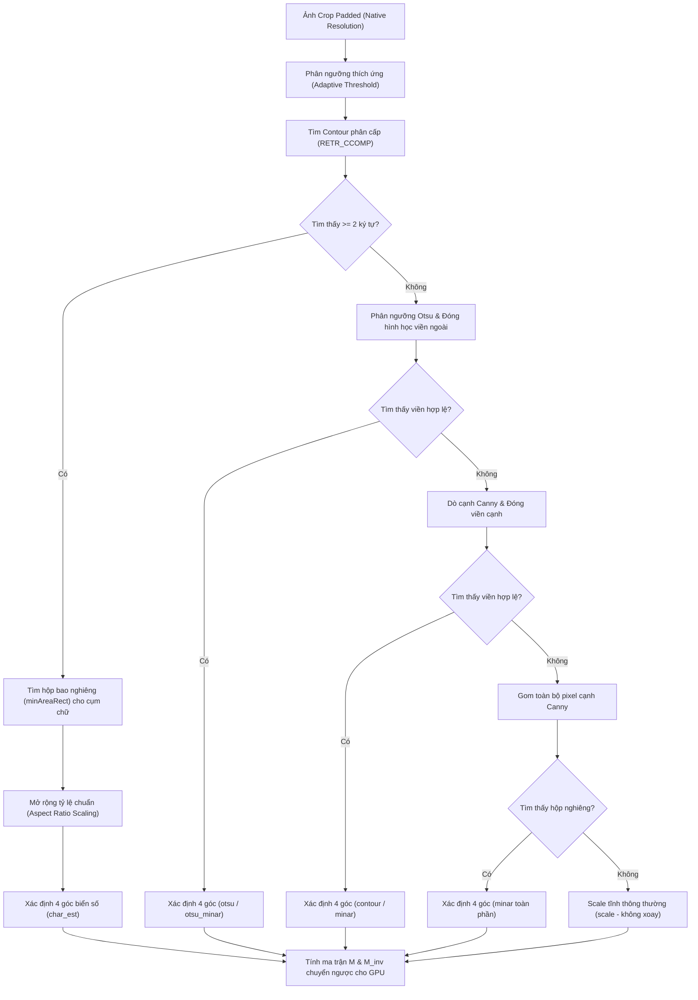

# Báo Cáo Kỹ Thuật Chuyên Sâu: DeepStream LPR Pipeline

**Ngày:** 2026-06-26  
**Phạm vi:** Toàn bộ hệ thống nhận dạng biển số xe (License Plate Recognition) xây dựng trên NVIDIA DeepStream SDK

---

## Mục Lục

1. [Tổng Quan Hệ Thống](#1-tổng-quan-hệ-thống)
2. [Kiến Trúc Pipeline GStreamer](#2-kiến-trúc-pipeline-gstreamer)
3. [Nguồn Đầu Vào & nvstreammux](#3-nguồn-đầu-vào--nvstreammux)
4. [PGIE — Phát Hiện Đối Tượng (YOLOv11s)](#4-pgie--phát-hiện-đối-tượng-yolov11s)
5. [Python Probe PGIE — Lọc Trước Tracker](#5-python-probe-pgie--lọc-trước-tracker)
6. [Custom Plugin dslaplacian — Đo Độ Nét GPU](#6-custom-plugin-dslaplacian--đo-độ-nét-gpu)
7. [nvtracker — Theo Dõi Đối Tượng](#7-nvtracker--theo-dõi-đối-tượng)
8. [SGIE3 Sink Probe — Ghi Nhận Biển Số Trước Inference](#8-sgie3-sink-probe--ghi-nhận-biển-số-trước-inference)
9. [SGIE3 — Nhận Diện Ký Tự OCR (nvinfer)](#9-sgie3--nhận-diện-ký-tự-ocr-nvinfer)
10. [OCR Decode — Thuật Toán CTC](#10-ocr-decode--thuật-toán-ctc)
11. [Metadata Probe — Xử Lý & Tổng Hợp Kết Quả](#11-metadata-probe--xử-lý--tổng-hợp-kết-quả)
12. [Hệ Thống Plate Text Processing](#12-hệ-thống-plate-text-processing)
13. [Vehicle–Plate Association](#13-vehicleplate-association)
14. [BBox Smoothing — Làm Mượt Tọa Độ](#14-bbox-smoothing--làm-mượt-tọa-độ)
15. [Cơ Chế Phát Sự Kiện (Event Emission)](#15-cơ-chế-phát-sự-kiện-event-emission)
16. [Quản Lý Trạng Thái (State Management)](#16-quản-lý-trạng-thái-state-management)
17. [Hệ Thống Cấu Hình & CLI](#17-hệ-thống-cấu-hình--cli)
18. [Phân Tích Điểm Nghẽn Hiệu Suất](#18-phân-tích-điểm-nghẽn-hiệu-suất)
19. [Kết Quả Đánh Giá — New OCR 2024](#19-kết-quả-đánh-giá--new-ocr-2024)
    - 19.1. [Tổng quan (15 video)](#191-tổng-quan-15-video-2026-06-25)
    - 19.2. [Số liệu pipeline theo từng video](#192-số-liệu-pipeline-theo-từng-video)
    - 19.3. [Phân tích pipeline funnel](#193-phân-tích-pipeline-funnel)
    - 19.4. [Phân bố vote khi emit](#194-phân-bố-vote-khi-emit)
    - 19.5. [Đặc trưng biển số](#195-đặc-trưng-biển-số-được-nhận-diện)
    - 19.6. [Tốc độ xử lý](#196-tốc-độ-xử-lý)
    - 19.7. [Fix quan trọng trong quá trình triển khai](#197-fix-quan-trọng-trong-quá-trình-triển-khai)
    - 19.8. [Tại sao bỏ LPRNet](#198-tại-sao-bỏ-lprnet)

---

## 1. Tổng Quan Hệ Thống

### Mục tiêu

Hệ thống nhận một hoặc nhiều luồng video (file MP4, RTSP) làm đầu vào, tự động phát hiện xe cộ, phát hiện biển số, nhận diện ký tự trên biển số, rồi phát ra **sự kiện có cấu trúc** (JSON) mỗi khi đọc được một biển số ổn định.

### Đầu vào — Đầu ra

| Đầu vào | Đầu ra |
|---|---|
| File MP4, RTSP stream, HTTP video | JSON event per biển số |
| Nhiều nguồn đồng thời (multi-source) | Ảnh crop biển số (JPEG) |
| Bất kỳ loại xe thương mại nào | Ảnh crop xe (JPEG) |
| Độ phân giải bất kỳ (chuẩn hóa về 1920×1080) | Kafka message (tuỳ chọn) |

### Công nghệ cốt lõi

- **NVIDIA DeepStream SDK** — framework xử lý video AI real-time dựa trên GStreamer
- **TensorRT (TRT)** — inference engine của NVIDIA, tối ưu hoá mô hình AI cho GPU
- **Python + PyDS** — Python bindings cho DeepStream metadata API, dùng để viết probe functions
- **OpenCV / CUDA** — xử lý ảnh trong C++ plugin và Python post-processing
- **GStreamer** — multimedia framework quản lý pipeline, buffer, và luồng dữ liệu

---

## 2. Kiến Trúc Pipeline GStreamer

### Sơ đồ luồng dữ liệu

```
[uridecodebin] ──┐
[uridecodebin] ──┤
       ...       │
[uridecodebin] ──┘
                 │  NV12/NVMM
                 ▼
         [nvstreammux]          ← chuẩn hoá về 1920×1080, gộp batch
                 │  batch frames (NVMM)
                 ▼
           [nvinfer PGIE]       ← YOLOv11s, phát hiện 14 class
                 │
           [PGIE Probe]         ← (Python) lọc non-vehicle, drop xe nhỏ
                 │
           [nvtracker]          ← NvDCF, gán object_id ổn định
                 │
          [dslaplacian]         ← (C++/CUDA) đo độ nét biển số
                 │
        [SGIE3 Sink Probe]      ← (Python) phân tách biển vuông → pseudo-objects
                 │
         [nvinfer SGIE3]        ← OCR model (New OCR 2024, lpr_ocr.20240305.onnx)
                 │
         [nvvideoconvert]       ← NVMM → RGBA (để đọc pixel trong Python)
                 │
          [capsfilter]          ← video/x-raw(memory:NVMM), format=RGBA
                 │
         [Metadata Probe]       ← (Python) OCR decode, vote, emit event
                 │
    [nvmultistreamtiler]        ← ghép multi-source thành 1 khung hiển thị
                 │
           [nvdsosd]            ← vẽ bbox, text lên frame
                 │
             [tee]              ─────────────────────────────┐
              │                                              │
     [queue-display]                                  [queue-file]
              │                                              │
    [nveglglessink]                          [nvvideoconvert → h264 → mp4]
    (hoặc fakesink)
```

### Vị trí gắn probe

| Probe | Vị trí | Loại |
|---|---|---|
| `pgie_src_pad_buffer_probe` | Pad SRC của nvinfer PGIE | `BUFFER` |
| `sgie3_sink_pad_buffer_probe` | Pad SINK của nvinfer SGIE3 | `BUFFER` |
| `metadata_src_pad_buffer_probe` | Pad SRC của capsfilter RGBA | `BUFFER` |
| `osd_sink_pad_buffer_probe` | Pad SINK của nvdsosd | `BUFFER` |

Các probe chạy **đồng bộ trong GStreamer pipeline thread** — nếu probe chậm thì cả pipeline bị block.

---

## 3. Nguồn Đầu Vào & nvstreammux

### uridecodebin

Mỗi video source được tạo một phần tử `uridecodebin` riêng. DeepStream tự động chọn decoder:

- **File MP4/H264/H265** → NVDEC (hardware decode trên GPU, zero-copy sang NVMM)
- **RTSP** → RTP depay → jitterbuffer → NVDEC
- **Fallback** → FFMPEG software decode (nếu không có NVDEC support)

Callback `cb_newpad` được gọi khi decoder tạo ra pad video, tự động link tới sinkpad của nvstreammux.

```python
source.connect("pad-added", cb_newpad, sinkpad)
```

### nvstreammux

**Vai trò:** Nhận nhiều luồng video từ nhiều nguồn, đồng bộ và gộp thành một batch tensor duy nhất gửi xuống PGIE.

**Cấu hình:**
```
width  = 1920          # resize tất cả input về 1920×1080
height = 1080
batch-size = num_sources
batched-push-timeout = 33000 µs  # ≈ 30fps budget
live-source = 0 (file) hoặc 1 (RTSP)
```

**Hoạt động:**
- Scale mỗi frame về 1920×1080 bằng CUDA (zero-copy trong NVMM)
- Gộp N frame của N nguồn thành 1 batch tensor NxCxHxW
- Gán `source_id` (0..N-1) cho mỗi frame trong batch để phân biệt nguồn
- Gán `frame_num` tăng dần per-source

**Kết quả:** Sau muxer, tất cả bbox đều ở không gian tọa độ 1920×1080, bất kể độ phân giải gốc của video.

---

## 4. PGIE — Phát Hiện Đối Tượng (YOLOv11s)

### Model

| Tham số | Giá trị |
|---|---|
| Kiến trúc | YOLOv11s |
| Input size | 640×640 (3 channel) |
| Số class | 14 |
| Precision | FP16 (TRT) |
| Batch size | = num_sources (động) |
| Interval | 0 (chạy mỗi frame) |

**File config:** `configs/config_pgie_yolov11s.txt`  
**Engine:** `models/yolov11s_14_cls_20241224.onnx_b{N}_gpu0_fp16.engine`

### 14 Class phát hiện

| Class ID | Tên | Vai trò |
|---|---|---|
| 0 | seater_12_16 | Xe khách 12-16 chỗ |
| 1 | bus | Xe buýt |
| 2 | car | Ô tô con |
| 3 | club_cart | Xe golf / mini |
| 4 | human | Người (bị lọc bỏ) |
| 5 | moto | Xe máy (bị lọc bỏ) |
| 6 | moto_rider | Người lái xe máy (bị lọc bỏ) |
| 7 | shuttle_bus_5_7 | Xe shuttle nhỏ |
| 8 | truck | Xe tải |
| 9 | bike | Xe đạp (bị lọc bỏ) |
| 10 | cyclist | Người đạp xe (bị lọc bỏ) |
| 11 | shuttle_bus_18 | Xe shuttle lớn |
| 12 | head | Đầu người (bị lọc bỏ) |
| **13** | **license_plate** | **Biển số xe** |

**VEHICLE_CLASS_IDS = {0, 1, 2, 3, 5, 6, 7, 8, 9, 10, 11}** — nhưng sau probe PGIE chỉ còn: `{0,1,2,3,7,8,11}` (các class phương tiện thực sự) + class 13 (biển số).

### Custom Parser

YOLOv11 không output theo format chuẩn YOLO của DeepStream, nên cần:
```
custom-lib-path=.../libnvds_infercustom_yolov11_flat.so
parse-bbox-func-name=NvDsInferParseCustomYoloV11Flat
```

Parser C++ này nhận raw output tensor và chuyển về `NvDsInferObjectDetectionInfo` mà DeepStream hiểu.

### NMS (Non-Maximum Suppression)

```ini
cluster-mode=2              # NMS clustering
pre-cluster-threshold=0.25  # confidence score threshold
nms-iou-threshold=0.45      # IoU threshold
topk=300                    # giữ tối đa 300 bbox per frame
```

Sau NMS, mỗi bbox được ghi vào `NvDsObjectMeta` trong batch metadata của frame.

### Chọn batch size động

```python
is_static_b1 = (onnx_name == "vehicle_parking_detect.onnx")
pgie_batch_size = 1 if is_static_b1 else num_sources
```

Với model YOLOv11s thì `pgie_batch_size = num_sources`. Engine TRT tương ứng được chọn tự động theo batch size.

---

## 5. Python Probe PGIE — Lọc Trước Tracker

**File:** `src/lpr/probes/pgie.py`  
**Vị trí:** Sau PGIE, **trước** nvtracker

### Mục đích

Loại bỏ các đối tượng không cần theo dõi **trước khi** đưa vào tracker — tiết kiệm tài nguyên tracker và giảm false positive.

### Logic lọc

```python
_PGIE_KEEP = config.VEHICLE_CLASS_IDS | {LP_CLASS_ID, LP_TOP_CLASS_ID, LP_BOT_CLASS_ID}
# = {0,1,2,3,5,6,7,8,9,10,11,13,14,15}
```

Với mỗi object trong frame:

1. **Class filter:** Nếu class không thuộc `_PGIE_KEEP` → xoá (`human`, `head`, `bike`, `cyclist` bị loại)
2. **Size filter (chỉ áp dụng cho vehicle class):**

```python
min_w = state.min_vehicle_width   # mặc định 60px
min_h = state.min_vehicle_height  # mặc định 40px

# Override bằng ratio nếu được cấu hình:
if state.min_vehicle_width_ratio > 0:
    min_w = int(state.min_vehicle_width_ratio * state.muxer_width)
if state.min_vehicle_height_ratio > 0:
    min_h = int(state.min_vehicle_height_ratio * state.muxer_height)

if w < min_w or h < min_h:
    _remove_obj(frame_meta, obj_meta)  # xe quá nhỏ/xa → bỏ
```

### Lý do lọc theo kích thước

Xe quá nhỏ (xa) có biển số quá nhỏ để OCR chính xác. Lọc ngay tại probe PGIE giúp:
- Tracker không phải cấp phát track_id cho xe sẽ không bao giờ được OCR
- SGIE3 không phải xử lý biển số không thể đọc được
- Giảm số lượng entry trong `vehicle_states` dict

### Ratio-based threshold (tính năng mới)

Cho phép ngưỡng tự động scale theo muxer resolution:

```
--min-vehicle-width-ratio 0.031  →  59px @ 1920  /  39px @ 1280  /  19px @ 640
--min-vehicle-height-ratio 0.037 →  39px @ 1080  /  26px @ 720   /  17px @ 480
```

---

## 6. Custom Plugin dslaplacian — Đo Độ Nét GPU

**File nguồn:** `custom_plugins/ds_laplacian/`  
**Output:** `.so` → `gst-plugins/libnvdsgst_laplacian.so`  
**Vị trí trong pipeline:** Sau nvtracker, trước SGIE3

### Tại sao cần plugin này?

Không phải mọi biển số được phát hiện đều rõ nét. Các biển số mờ (xe ở xa, chuyển động nhanh, nén video mạnh) nếu đưa vào OCR sẽ tạo ra kết quả nhiễu, tốn GPU. Plugin này hoạt động như **hardware filter** — đo độ sắc nét ngay trên VRAM, loại bỏ biển số mờ **trước khi** SGIE3 inference.

### Kiến trúc 3 bước Hybrid CPU-GPU

**Bước 1 — Crop nhỏ từ GPU sang Mapped Memory:**

CUDA kernel chạy song song, chỉ copy vùng bounding box của biển số (ví dụ 150×50px) từ VRAM sang Mapped Memory (vùng RAM được cả CPU và GPU truy cập). Không copy toàn bộ frame Full HD.

```cpp
__global__ void crop_resize_kernel(const uint8_t* in_data, int in_pitch, ...) {
    int x = blockIdx.x * blockDim.x + threadIdx.x;
    int y = blockIdx.y * blockDim.y + threadIdx.y;
    out_data[y * out_w + x] = in_data[src_y * in_pitch + src_x];
}
```

**Bước 2 — Căn chỉnh góc nghiêng và Tìm 4 góc biển số (CPU, thuật toán độ phân giải gốc & định vị ký tự):**

CPU nhận ảnh nhỏ được GPU cắt kèm 30% padding ở độ phân giải gốc (Native Resolution), không qua nội suy resize để bảo toàn độ sắc nét tối đa. Quy trình xử lý gồm các chiến lược sau:

1. **Chiến lược Ưu tiên: Định vị lõi ký tự (Character-Based Alignment - `char_est`):**
   - **Adaptive Thresholding:** Chạy `cv::adaptiveThreshold` với kích thước khối $11 \times 11$ và hằng số giảm nhiễu $C = 2$ để bóc tách chữ số đen trên nền trắng, tránh hoàn toàn ảnh hưởng của cản xe (bumper) sáng màu xung quanh.
   - **RETR_CCOMP & Lọc Heuristic:** Tìm các contour trong phân cấp 2 mức (`cv::RETR_CCOMP`) để lọc ra các contour ký tự thực sự (không lấy viền ngoài bumper) dựa trên kích thước tỷ lệ (chiều cao h: $15\% - 85\%$, chiều rộng w: $2\% - 35\%$, tỷ lệ khung hình $0.5 - 6.0$, độ đặc solidity $> 0.15$).
   - **Gom cụm & minAreaRect:** Gom tọa độ của tất cả các chữ số hợp lệ (yêu cầu $\ge 2$ ký tự) và tìm hộp bao nghiêng tối thiểu (`cv::minAreaRect`). Hộp bao này phản ánh chính xác 100% góc xoay và tâm của biển số.
   - **Mở rộng theo Tỷ lệ chuẩn (Aspect Ratio Scaling):** Dựa vào tỷ lệ khung hình lõi chữ để nhận dạng biển dài hay vuông, ta nhân rộng kích thước hộp nghiêng ra ngoài biên biển thật (biển dài: rộng $\times 1.25$, cao $\times 1.65$; biển vuông: rộng $\times 1.35$, cao $\times 1.25$) để khôi phục 4 góc của biển số thật.

2. **Cơ chế Fallback Đa tầng (Robust Fallback Stack):**
   Nếu số lượng ký tự tìm thấy $< 2$ (do biển quá mờ, che khuất hoặc tối tăm), hệ thống tự động kích hoạt các cấp dự phòng liên tiếp:
   - **Cấp độ 2 (Otsu Contour):** Làm mịn ảnh bằng Gaussian Blur, chạy phân ngưỡng toàn cục Otsu, đóng hình học `MORPH_CLOSE` nối viền ngoài và xấp xỉ tứ giác `approxPolyDP` hoặc dùng `minAreaRect` của viền lớn nhất (`otsu` / `otsu_minar`).
   - **Cấp độ 3 (Canny Contours):** Dò cạnh Canny biên độ cao ($50 - 150$), đóng viền cạnh và tìm góc lồi hoặc hộp bao nghiêng của các đường cạnh (`contour` / `minar`).
   - **Cấp độ 4 (Canny minAreaRect toàn phần):** Vẽ hộp bao nghiêng tối thiểu `minAreaRect` bao phủ toàn bộ các pixel cạnh Canny tìm được trong ảnh (`minar` toàn phần).
   - **Cấp độ 5 (Scale tĩnh cuối cùng):** Nếu tất cả các bước trên đều thất bại, hệ thống tự động trả về ma trận scale thuần túy (không xoay) để đảm bảo pipeline GStreamer chạy liên tục, không bao giờ bị crash và vẫn trả về ảnh tốt nhất cho SGIE3.

**Sơ đồ khối thuật toán căn chỉnh biển số:**



**Bước 3 — Warp + Equalize + Blur + Laplacian (GPU, tất cả trong 2 kernel):**

**Kernel 3.1: Warp Perspective & Min/Max**
- Mỗi thread GPU nhân ma trận M_inv để dịch chuyển 1 pixel về vị trí thẳng đứng
- Đồng thời dùng `atomicMin` / `atomicMax` để tìm giá trị pixel min/max cho bước equalize

**Kernel 3.2: Stretch + Blur + Laplacian (all-in-one):**
```cpp
__global__ void stretch_blur_laplacian_kernel(...) {
    // 1. Contrast Stretching (thay thế EqualizeHist)
    float val = (raw_val - min_val) * 255.0f / (max_val - min_val);

    // 2. Gaussian Blur 3×3 (khử nhiễu nén video)
    float blur_val = val*0.25f + neighbors*0.125f + corners*0.0625f;

    // 3. Laplacian variance (đo độ sắc nét)
    float diff = blur_val - mean_val;
    atomicAdd(out_variance, diff * diff);
}
```

Ba phép toán gộp thành **1 kernel pass** — tiết kiệm memory bandwidth GPU so với 3 pass riêng lẻ.

### Truyền điểm số về Python

Plugin ghi kết quả vào slot `misc_obj_info[0]` trong `NvDsObjectMeta` của biển số:

```cpp
obj_meta->misc_obj_info[0] = (int)variance;  // ví dụ: 245
```

Python probe đọc lại:

```python
lap_score = int(p.misc_obj_info[0])
if lap_score < 150 and lap_score > 0:
    continue  # biển số mờ → bỏ qua, không chạy OCR
```

### Phân vùng điểm số Laplacian

| Điểm | Ý nghĩa |
|---|---|
| 0 | Plugin không chạy / không tính được (bỏ qua, không lọc) |
| 1–149 | Mờ, nhiễu, không đủ nét → skip OCR |
| 150–300 | Nét vừa đủ → cho qua |
| 300–700 | Nét tốt |
| > 700 | Rất sắc nét |

---

## 7. nvtracker — Theo Dõi Đối Tượng

### Cấu hình

```
ll-lib-file = libnvds_nvmultiobjecttracker.so  (NvDCF)
ll-config-file = config_tracker_NvDCF_noReid.yml
tracker-width  = 640
tracker-height = 384
gpu-id = 0
```

**Thuật toán:** NvDCF (NVIDIA Discriminative Correlation Filter) — không dùng Re-ID.

### Vai trò

- Nhận object detections từ PGIE (đã lọc qua probe)
- Gán `object_id` (track ID) ổn định cho mỗi xe/biển qua nhiều frame
- Dự đoán vị trí khi PGIE bỏ qua 1 frame (frame skip với pgie-interval > 0)
- Xử lý occlusion (che khuất tạm thời)

### Điều quan trọng về track ID

`object_id` là **định danh duy nhất** trong suốt vòng đời của 1 xe trong frame. Mọi metadata (bbox history, plate text votes, event emit state) đều được key bởi `(source_id, object_id)`. Khi tracker mất track → new track = new object_id = history bị reset.

---

## 8. SGIE3 Sink Probe — Ghi Nhận Biển Số Trước Inference

**File:** `src/lpr/probes/sgie3.py`  
**Vị trí:** Pad SINK của SGIE3, **trước** khi SGIE3 inference chạy

### New OCR 2024 xử lý biển vuông nội bộ — không cần tách top/bot

Biển số Việt Nam có 2 loại dạng vật lý:
- **Biển ngang (1 dòng):** W/H ≈ 2.5–4.0 — ví dụ biển ô tô
- **Biển vuông (2 dòng):** W/H < 1.7 — phổ biến ở xe máy và xe tải

Model cũ (LPRNet) chỉ nhận diện 1 dòng văn bản. Khi gặp biển vuông phải tách top/bot thành pseudo-objects riêng lẻ trước khi đưa vào inference — phức tạp và dễ sai.

**New OCR 2024 giải quyết khác:** Model được train với ký tự đặc biệt `_` (separator, class index 36 trong 37-class vocab) làm dấu phân cách giữa 2 dòng. Model nhận ảnh toàn biển (kể cả biển vuông) và tự output:

```
Input biển vuông "51A / 12345" → CTC output: "51A_12345"
                                               ^^^
                                               separator dòng
```

Python decode (`ocr.py`) xử lý `_` → `-` (không ảnh hưởng normalization):
```python
text = "".join(chars).replace("_", "-")  # "51A-12345"
# → _correct_vn_plate() → _normalize_plate_for_output() strip '-' → "51A12345"
# → _plate_pattern_score("51A12345") → 6.1 (full score)
```

**Kết quả:** Toàn bộ logic tách biển vuông, pseudo-object, `pseudo_parent_map`, `LP_TOP_CLASS_ID/LP_BOT_CLASS_ID` đã được loại bỏ. `operate-on-class-ids=13` — SGIE3 chỉ xử lý biển số nguyên (class 13).

### Probe hiện tại — Đơn giản và nhanh

```python
def sgie3_sink_pad_buffer_probe_new(pad, info, u_data):
    for obj_meta in frame_objects:
        if (obj_meta.class_id == config.LP_CLASS_ID  # class 13
                and obj_meta.unique_component_id == config.PGIE_UNIQUE_ID):
            if obj_meta.object_id not in state.locked_plate_ids:
                r = obj_meta.rect_params
                state.plate_rects[(sid, obj_meta.object_id)] = (
                    r.left, r.top, r.width, r.height
                )
```

**Hai nhiệm vụ:**
1. Cập nhật FPS counter per-source
2. Ghi bbox của biển số chưa lock vào `state.plate_rects` — dùng cho vehicle–plate association ở metadata probe

**Biển đã lock (`object_id in state.locked_plate_ids`):** Probe bỏ qua, không ghi bbox. SGIE3 vẫn inference (vì class_id không bị đổi), nhưng kết quả inference sẽ được metadata probe phân loại qua voting và không thay đổi stable text (do `_should_replace_stable_text` yêu cầu bằng chứng mạnh hơn).

---

## 9. SGIE3 — Nhận Diện Ký Tự OCR (nvinfer)

### Model OCR: New OCR 2024

Model LPRNet (baseline18) đã được loại bỏ. Hệ thống hiện tại chỉ dùng một model duy nhất: `lpr_ocr.20240305.onnx`.

| Tham số | Giá trị |
|---|---|
| File | `lpr_ocr.20240305.onnx` |
| Engine | `lpr_ocr.20240305.onnx_b8_gpu0_fp16.engine` |
| Input size | 3×64×128 (BGR float) |
| Normalize | Model tự normalize nội bộ với ImageNet mean/std (scale=1.0) |
| Color format | BGR (`color-format=1`) |
| Network type | 100 (custom CTC) |
| Precision | FP16 (TRT) |
| Batch size | 8 |
| Output layer | `"output"` — tensor float32 shape [T=15, C=37], đã qua softmax |
| Số class | 37 (blank + 10 chữ số + 25 chữ cái không có O + separator `_`) |
| `operate-on-class-ids` | `13` — chỉ biển số nguyên, không cần top/bot |

**So với LPRNet (baseline18) đã loại bỏ:**

| Tiêu chí | LPRNet (đã bỏ) | New OCR 2024 (hiện tại) |
|---|---|---|
| Input | 3×48×96, RGB, scale=1/255 | 3×64×128, BGR, scale=1.0 |
| Biển VN hợp lệ | 88.5% | **100%** |
| Lỗi ký tự thừa | Hay thêm `0` thừa vào suffix | Không có |
| Sự kiện trên 15 video | 131 | **169 (+29%)** |
| OCR confidence | 0.862 (cao hơn nhưng overfit) | 0.807 |

### Hoạt động của nvinfer (Secondary GIE)

```ini
process-mode=2                 # secondary mode (chạy trên detected objects)
operate-on-gie-id=1            # chỉ nhận output từ PGIE (unique_id=1)
operate-on-class-ids=13        # chỉ xử lý biển số nguyên (LP class)
interval=0                     # chạy mỗi frame
secondary-reinfer-interval=0   # reinfer mỗi frame cho mỗi track_id
output-tensor-meta=1           # ghi raw tensor vào metadata (để Python decode)
```

SGIE3 crop từng bbox class 13 từ frame, resize về **64×128** (3 channel BGR), chạy TRT inference, ghi output tensor float32 `[T=15, C=37]` vào `NvDsUserMeta` → `NvDsInferTensorMeta` của từng object.

**Quan trọng:** `output-tensor-meta=1` — SGIE3 không decode text mà ghi raw softmax tensor, để Python decode CTC theo thuật toán tùy chỉnh có xử lý ký tự `_` separator.

**Lưu ý về throttle:** `secondary-reinfer-interval=0` nghĩa là SGIE3 reinfer mỗi frame cho mỗi plate track. Đây là tải GPU cao nhất trong pipeline — muốn giảm tải, tăng giá trị này (ví dụ =5 → reinfer mỗi 5 frame/track). Giá trị `OCR_EVERY_N = 6` trong `state.py` được khai báo nhưng không thực thi (xem Bottleneck #1 section 18).

---

## 10. OCR Decode — Thuật Toán CTC

**File:** `src/lpr/ocr.py`  
**Hàm chính:** `_read_lpr_text(obj_meta, gie_unique_id)`

### Vocab 37 class và ký tự đặc biệt `_`

Model output tensor `[T=15, C=37]` — 15 time steps, 37 class scores đã qua softmax.

```python
_NEW_VOCAB = [
    "❌",                                           # index 0  = CTC blank
    "0","1","2","3","4","5","6","7","8","9",        # index 1-10 = chữ số
    "A","B","C","D","E","F","G","H","I","J",
    "K","L","M","N","P","Q","R","S","T","U",
    "V","W","X","Y","Z",                            # index 11-35 = chữ cái (không có O)
    "_",                                            # index 36 = separator 2 dòng
]
_NEW_BLANK = 0
```

**Lý do không có O:** Dễ nhầm với `0` (số không) trong biển số. Model được train không có class O.

**Ký tự `_` (separator):** Model học cách đặt `_` giữa dòng 1 và dòng 2 khi gặp biển vuông (2 dòng). Biển ngang không có `_` trong output.

### Greedy CTC Decode

```python
def _decode_new_ctc(floats, T, C):
    """Greedy CTC: argmax → collapse repeats → remove blank → _ to -."""
    chars, confs, prev = [], [], _NEW_BLANK
    for t in range(T):
        row_start = t * C
        # Lấy class có score cao nhất tại time step t
        best_idx = max(range(C), key=lambda i: floats[row_start + i])
        # Giữ lại nếu: không phải blank (0) VÀ không trùng time step trước
        if best_idx != _NEW_BLANK and best_idx != prev:
            chars.append(_NEW_VOCAB[best_idx])
            confs.append(floats[row_start + best_idx])
        prev = best_idx
    # Đổi '_' separator thành '-', sau đó normalization sẽ strip '-'
    text = "".join(chars).replace("_", "-")
    conf = sum(confs) / len(confs) if confs else 0.0
    return text, conf
```

**Quy trình CTC greedy:**
1. Tại mỗi time step t (0→14): lấy argmax → class thắng
2. Nếu class ≠ blank (0) và ≠ class của step trước: giữ lại ký tự
3. Ký tự lặp liên tiếp (`55→5`) và blank được loại bỏ tự động
4. Confidence = trung bình softmax score của các ký tự giữ lại

**Ví dụ decode biển vuông `51A-12345`:**
```
T=0: "5" → T=1: "1" → T=2: blank → T=3: "A" → T=4: "_"
T=5: "1" → T=6: "2" → T=7: "3" → T=8: "4" → T=9: "5" → T=10-14: blank
→ chars = ["5","1","A","_","1","2","3","4","5"]
→ text = "51A_12345" → replace → "51A-12345"
→ _correct_vn_plate() → _normalize_plate_for_output() strip '-' → "51A12345"
→ _plate_pattern_score("51A12345") = 6.1 ✓
```

### Đọc từ tensor metadata DeepStream

```python
def _read_lpr_text(obj_meta, gie_unique_id):
    l_user = obj_meta.obj_user_meta_list
    while l_user is not None:
        user_meta = pyds.NvDsUserMeta.cast(l_user.data)
        if user_meta.base_meta.meta_type == NVDSINFER_TENSOR_OUTPUT_META:
            tensor_meta = pyds.NvDsInferTensorMeta.cast(user_meta.user_meta_data)
            if tensor_meta.unique_id == gie_unique_id:  # SGIE3_UNIQUE_ID = 4
                for i in range(tensor_meta.num_output_layers):
                    layer = pyds.get_nvds_LayerInfo(tensor_meta, i)
                    if layer.layerName != "output":  # tên layer trong ONNX
                        continue
                    # dims: [T, C] hoặc [1, T, C]
                    T, C = dims.d[0], dims.d[1]  # thường 15, 37
                    ptr = ctypes.cast(pyds.get_ptr(layer.buffer),
                                      ctypes.POINTER(ctypes.c_float))
                    floats = [ptr[j] for j in range(T * C)]
                    return _decode_new_ctc(floats, T, C)
    return "", 0.0
```

Python dùng ctypes để đọc trực tiếp từ buffer VRAM đã được DeepStream copy về CPU-accessible memory.

---

## 11. Metadata Probe — Xử Lý & Tổng Hợp Kết Quả

**File:** `src/lpr/probes/metadata.py`  
**Vị trí:** Pad SRC của capsfilter (sau SGIE3, trước tiler)  
**Đây là probe nặng nhất — chạy mọi frame, O(vehicles × plates × candidates)**

### 11.1 Phân loại đối tượng trong frame

```python
vehicles = []  # PGIE objects thuộc VEHICLE_CLASS_IDS, đã có tracker ID
plates   = []  # PGIE objects class_id == 13 (LP_CLASS_ID)
               # class 99 trong code nhưng không bao giờ được set bởi sgie3.py hiện tại
```

**Lưu ý:** Không còn `plate_parts` (class 14/15). New OCR 2024 xử lý biển vuông nội bộ, không cần tách top/bottom thành pseudo-objects riêng.

### 11.2 Cập nhật Vehicle Track State

Mỗi xe được quản lý bởi một `VehicleTrackState` object, key là `(sid, object_id)`:

```python
vs = lpr_state.vehicle_states[(sid, vid)]
vs.last_seen_frame = frame_num
vs.vehicle_confidence = float(v.confidence)
```

**BBox smoothing cho xe:**
```python
iou = _bbox_iou(vs.vehicle_bbox, raw_v_bbox)
cdist = _bbox_center_distance(vs.vehicle_bbox, raw_v_bbox)
max_jump = bbox_max_center_jump_ratio * max(w, h)  # 0.5 × max(width, height)

if iou < bbox_reset_iou or cdist > max_jump:
    vs.vehicle_bbox = raw_v_bbox  # reset: xe nhảy quá mạnh (traffic cut, occlusion)
else:
    vs.vehicle_bbox = EMA(vs.vehicle_bbox, raw_v_bbox, alpha=0.4)  # smoothing
```

### 11.3 Đánh Giá Chất Lượng Nguồn & Lọc Động (Dynamic Quality Routing)

Mỗi frame, hệ thống đánh giá nguồn video theo **4 điều kiện**, gán nhãn `LQ` (Low Quality) hoặc `HQ` (High Quality) và điều chỉnh ngưỡng lọc phù hợp:

```python
# ── Source Quality Assessment ─────────────────────────────────────────
sid_str = f"stream{frame_meta.source_id}"
stream_fps = lpr_state.perf_data.get_current_fps(sid_str)
source_uri = lpr_state.source_uri_by_id.get(frame_meta.source_id, "")

is_forced_lq = config.FORCE_LQ_RTSP and "rtsp://" in source_uri   # c1
c1 = is_forced_lq                                                   # giao thức: RTSP → LQ
c2 = (0 < frame_meta.source_frame_width  < 1280)                   # không gian: < HD
c3 = (0 < frame_meta.source_frame_height < 720)                    # không gian: < HD
c4 = (0 < stream_fps < 15)                                         # thời gian: FPS thấp
is_low_quality_source = c1 or c2 or c3 or c4

for p in plates:
    is_low_quality = is_low_quality_source

    # Dynamic Confidence Filter (YOLO detection score)
    target_conf = 0.15 if is_low_quality else 0.25
    if p.confidence > 0.0 and p.confidence < target_conf:
        continue

    # Pixel size filter (tuyệt đối, không phụ thuộc LQ/HQ)
    if p.rect_params.width < lpr_state.min_plate_width or p.rect_params.height < lpr_state.min_plate_height:
        continue

    # Dynamic Laplacian Filter (độ nét GPU)
    if not getattr(lpr_state, 'disable_laplacian', False):
        lap_score = int(p.misc_obj_info[0])
        target_lap = 50 if is_low_quality else 150
        if lap_score < target_lap and lap_score > 0:
            continue
```

**Bảng ngưỡng theo chất lượng nguồn:**

| Điều kiện đánh giá | LQ (Low Quality) | HQ (High Quality) |
|---|---|---|
| Giao thức RTSP (`FORCE_LQ_RTSP=True`) | → LQ | — |
| Độ phân giải < 1280×720 | → LQ | ≥ 1280×720 |
| FPS thực đo < 15 | → LQ | ≥ 15 FPS |
| **YOLO confidence ngưỡng** | ≥ 0.15 | ≥ 0.25 |
| **Laplacian ngưỡng** | ≥ 50 | ≥ 150 |
| Pixel size ngưỡng (width × height) | `min_plate_width × min_plate_height` (cố định) | ← cùng giá trị |

**Lý do thiết kế 2 tầng ngưỡng:**
- Camera nét (HQ): Siết chặt ngưỡng để giảm nhiễu OCR, tăng precision
- Camera mờ/xa (LQ): Nới lỏng để tối đa recall, tránh bỏ sót sự kiện

**Hiển thị OSD:** nhãn `LQ`/`HQ` được vẽ trực tiếp lên video (`osd.py`) để debug thực tế.

**Lưu ý cấu hình hiện tại:** `FORCE_LQ_RTSP = True` trong `lpr_config.py` — tất cả nguồn RTSP được xử lý như LQ bất kể độ phân giải thực. Tắt flag này nếu RTSP source là camera chất lượng cao.

### 11.4 OCR Decode và Chọn Best Plate Per Frame

Với mỗi plate `p` trong `plates` (class 13, đã qua filter ở 11.3):

```python
vid, assoc_method, assoc_score = _associate_plate_to_vehicle(p, vehicles)
# → tìm xe sở hữu biển này (xem section 13)

full_text, full_conf = _read_lpr_text(p, config.SGIE3_UNIQUE_ID)
# → CTC decode từ tensor SGIE3, xử lý '_' separator nội bộ

best_cand_text = _correct_vn_plate(full_text)
# → sửa nhầm lẫn ký tự theo cấu trúc biển VN (xem 12.1)

if not best_cand_text:
    continue  # OCR không ra gì hợp lệ → bỏ qua frame này cho plate này

best_cand_score = _plate_quality_score(
    best_cand_text, best_cand_conf,
    p.rect_params.width, p.rect_params.height, assoc_score
)
# → điểm tổng hợp: format + confidence + kích thước + association

# Giữ plate có điểm cao nhất trong frame này cho mỗi xe
if track_key not in frame_best_plates or best_cand_score > frame_best_plates[track_key]['score']:
    frame_best_plates[track_key] = {
        'p': p, 'score': best_cand_score, 'text': best_cand_text,
        'conf': best_cand_conf, 'assoc_method': assoc_method, 'assoc_score': assoc_score,
    }
```

**Thiết kế đơn giản nhờ New OCR 2024:** Không cần ghép top+bot, không cần thử nhiều cách join. Model xử lý biển vuông nội bộ → 1 candidate duy nhất per plate per frame. Chỉ cần chọn plate có score cao nhất trong frame (nếu cùng 1 xe có nhiều detection của cùng 1 biển).

---

## 12. Hệ Thống Plate Text Processing

**File:** `src/lpr/plate_text.py`

### 12.1 `_correct_vn_plate(raw)` — Sửa lỗi nhận dạng

Biển số VN có cấu trúc cứng: `[tỉnh][chữ cái series][số]`. OCR hay nhầm:
- Số → chữ: `0→D, 1→K, 5→S, 8→B`
- Chữ → số: `B→8, O→0, S→5, I→1`

Hàm thử mọi `series_len` (1 hoặc 2 chữ cái series), sửa từng vị trí theo quy tắc:

```python
for idx in range(min(2, len(chars))):
    chars[idx] = fix(chars[idx], want_digit=True)   # 2 số đầu = mã tỉnh
for idx in range(2, suffix_start):
    chars[idx] = fix(chars[idx], want_digit=False)  # series = chữ cái
for idx in range(suffix_start, len(chars)):
    chars[idx] = fix(chars[idx], want_digit=True)   # suffix = số
```

Trả về variant có `_plate_pattern_score` cao nhất.

### 12.2 `_plate_pattern_score(text)` — Đánh giá format

Cho điểm dựa trên việc text có khớp format biển VN không:

| Điều kiện | Điểm |
|---|---|
| Không đúng format (< 7 ký tự, prefix không phải số) | 0.0 |
| Đúng format cơ bản | 5.0 |
| Series 1 chữ cái | +0.50 |
| Series 2 chữ cái | +0.35 |
| Suffix 5 chữ số | +0.60 |
| Suffix 4 chữ số | +0.25 |

**Score ≥ 5.0** = hợp lệ format. Score 0.0 = không hợp lệ.

### 12.3 `_plate_quality_score(text, conf, w, h, assoc_score)` — Điểm tổng hợp

```python
score = _plate_pattern_score(text)        # format score (5.0–6.1)
if score <= 0: return 0.0                 # format không hợp lệ → loại ngay

score += conf * 2.0                       # OCR confidence (0–2.0)
size_factor = min(1.0, w*h / 10000.0)    # kích thước (0–1.0, saturate ở 100×100)
score += size_factor
score += max(0.0, association_score)      # xe–biển association (0–1.0)
```

**Range thực tế:** 7.0–9.5. Điểm cao = format đúng + OCR tin cậy + biển lớn + gắn chắc với xe.

### 12.4 `_stable_plate(track_key, text, conf, w, h, assoc_score)` — Voting & Clustering

Duy trì `state.plate_history[track_key]` — list tối đa **30 readings** gần nhất (sliding window, trim về 30 nếu vượt).

**Bước 1 — Nạp reading mới:**
```python
norm = _correct_vn_plate(raw_text)
score = _plate_quality_score(norm, conf, width, height, assoc_score)
if score > 0:
    hist.append({"text": norm, "score": score})
```

**Bước 2 — Đếm votes và best_score per text:**
```python
for item in hist:
    counts[item["text"]] += 1
    best_score[item["text"]] = max(best_score.get(item["text"], 0), item["score"])
```

**Bước 3 — Clustering: gộp text "gần giống nhau"**

Hai text được xem là cùng cluster nếu:
```python
def _plate_similar_enough(a: str, b: str) -> bool:
    for series_len in (1, 2):
        prefix = 2 + series_len  # "51A" hoặc "51AB"
        if a[:prefix] == b[:prefix]:        # cùng tỉnh + series
            sa, sb = a[prefix:], b[prefix:] # so suffix
            if abs(len(sa) - len(sb)) <= 1 and _levenshtein(sa, sb) <= 1:
                return True  # suffix chỉ khác 1 ký tự (OCR noise)
    return False
```

Ví dụ: `"51B0123"` và `"51B0124"` → cùng cluster (prefix `51B` giống, suffix `0123` vs `0124` differ by 1). Điều này hấp thụ lỗi OCR nhỏ thành 1 cluster mạnh hơn thay vì 2 cluster yếu.

Đại diện cluster (`rep`) = text có `(best_score, counts)` cao nhất. Cluster votes = tổng counts của tất cả text trong cluster. Cluster score = max best_score của tất cả text trong cluster.

**Bước 4 — Chọn best stable candidate:**
```python
for rep, c in cluster_votes.items():
    sc = cluster_score[rep]
    strong_single = (
        c >= 1                                    # ít nhất 1 vote
        and sc >= _SINGLE_VOTE_ACCEPT_SCORE       # = 8.0 (rất cao)
        and _plate_pattern_score(rep) >= 5.5      # format chuẩn
    )
    if c >= state.min_stable_votes or strong_single:
        val = c + sc                              # tổng hợp votes + score
        if val > best_val:
            best_cand = rep
```

**Hai điều kiện chấp nhận "stable":**
- **Normal path:** `cluster_votes ≥ min_stable_votes` (mặc định 2) — cần ít nhất 2 readings đồng ý trong cluster
- **Fast path:** reading đơn lẻ nhưng điểm ≥ 8.0 và format chuẩn — biển số rõ nét, chắc chắn đúng từ lần đầu

**Insight quan trọng về xe tiến lại gần:**
Khi xe ở xa: `size_factor` nhỏ (biển nhỏ trên frame) → `_plate_quality_score` thấp → cluster `val` thấp. Khi xe đến gần: biển chiếm diện tích lớn hơn → `size_factor = min(1.0, w*h/10000)` tăng → score tăng → cluster được ưu tiên ngay cả khi votes bằng nhau. Hệ thống tự nhiên hội tụ về kết quả đọc được từ biển lớn/gần nhất.

### 12.5 `_should_replace_stable_text(...)` — Override Biển Đã Ổn Định

Đây là cơ chế **bảo vệ kết quả đúng đồng thời cho phép tinh chỉnh khi có bằng chứng tốt hơn**. Hàm được gọi mỗi khi voting ra một stable candidate mới cho một xe đã có stable text.

```python
def _should_replace_stable_text(current_text, current_score, current_votes,
                                new_text, new_score, new_votes) -> bool:
    if not current_text:
        return True                        # chưa có stable → nhận ngay

    if new_text == current_text:
        return new_score > current_score or new_votes > current_votes
        # cùng biển → cập nhật nếu score/votes tốt hơn (không cần kiểm tra thêm)

    major_change = _major_plate_change(current_text, new_text)
    # major = True nếu: mã tỉnh khác (current[:2] ≠ new[:2])
    #                 HOẶC độ tương đồng ký tự < 55%

    if major_change and new_pattern < current_pattern:
        return False                       # Anti-jitter gate: major change mà format kém hơn → từ chối ngay

    vote_margin  = 2 + (2 if major_change else 0)   # 2 (normal) hoặc 4 (major)
    score_margin = 1.25 + (1.0 if major_change else 0.0) # 1.25 (normal) hoặc 2.25 (major)

    enough_votes       = new_votes >= current_votes + vote_margin
    clearly_better_shape = new_pattern > current_pattern and new_score >= current_score + 0.5
    clearly_better_score = new_score >= current_score + score_margin and \
                           new_votes >= max(state.min_stable_votes, current_votes)

    return enough_votes or clearly_better_shape or clearly_better_score
```

**3 điều kiện override (chỉ cần 1 đúng):**

**Điều kiện 1 — Clearly Better Shape (chuẩn cú pháp hơn):**
```
new_pattern_score > current_pattern_score  AND  new_score ≥ current_score + 0.5
```
Áp dụng khi: biển cũ đọc sai format (ví dụ 6 ký tự thay vì 7-8), biển mới đọc đúng format biển VN. Yêu cầu thêm điều kiện score để loại trường hợp "format đúng ngẫu nhiên" từ OCR noise. Không phụ thuộc votes — 1 reading format chuẩn với score đủ cao là đủ.

**Điều kiện 2 — Enough Votes (áp đảo số lần bầu chọn):**
```
new_votes ≥ current_votes + 2   (hoặc + 4 nếu major change)
```
Áp dụng khi: biển cũ được lock với 2 votes "ăn may", sau đó biển đúng tích lũy thêm 4+ votes khi xe đến gần. Không quan tâm score — số lần xuất hiện áp đảo là bằng chứng thống kê đủ mạnh.

**Điều kiện 3 — Clearly Better Score (chất lượng ảnh vượt trội):**
```
new_score ≥ current_score + 1.25   AND   new_votes ≥ max(min_stable_votes, current_votes)
```
Áp dụng khi: xe đi từ xa đến gần camera — biển lớn hơn → `size_factor` trong `_plate_quality_score` tăng đáng kể → score tăng vọt. Kết hợp với đủ votes → ghi đè kết quả cũ.

**Cơ chế Anti-Jitter (chống nhiễu ghi đè):**

Nếu new_text và current_text là **major change** (khác mã tỉnh HOẶC similarity < 55%):
- `vote_margin` tăng từ 2 → **4** (cần votes áp đảo hơn gấp đôi)
- `score_margin` tăng từ 1.25 → **2.25** (cần vượt trội score lớn hơn nhiều)
- Gate cứng: `major_change AND new_pattern < current_pattern` → từ chối ngay (không cần check 3 điều kiện)

**Lý do thiết kế:** Một frame mờ hoặc bị che khuất có thể cho ra OCR kết quả sai hoàn toàn (khác mã tỉnh). Nếu không có anti-jitter, kết quả đúng đã được lock sẽ bị ghi đè bởi 1 reading nhiễu có votes cao hơn. Yêu cầu gấp đôi makes override gần như impossible trừ khi biển mới thực sự xuất hiện liên tục và nhất quán.

**Insight — Vòng đời điển hình của 1 xe:**
```
Frame 10-30: Xe ở xa → biển nhỏ → score thấp → votes tích lũy chậm → stable="51B0123" với 2 votes, score=7.2
Frame 40-60: Xe đến gần → biển lớn hơn → score tăng: 7.2→8.1 → same text "51B0123"
             → _should_replace_stable_text("51B0123", 7.2, 2, "51B0123", 8.1, 4) = True
             → cập nhật score và votes, không phát event mới (same text)
Frame 60+:   Biển lock kích hoạt (votes≥3, score≥4.0)
             → NHƯNG AI vẫn đọc tiếp mỗi frame
             → Nếu thực sự biển khác (vd: camera đọc nhầm trước): "51B0456"
             → cần 6 votes và score tăng 1.25 (normal) hoặc 4 votes + 2.25 (major) → rất khó qua
```

### 12.6 OCR Lock — Khoá Biển + Throttle GPU + Anti-Spam

Đây là cơ chế 3 trong 1: **giảm tải GPU**, **chống spam event**, và vẫn **cho phép tinh chỉnh kết quả** khi cần.

#### Điều kiện Lock

```python
# metadata.py — sau khi stable text được cập nhật
if vs.best_votes >= lpr_state.ocr_lock_min_votes  # mặc định 3 votes
   and vs.best_score >= lpr_state.ocr_lock_min_score:  # mặc định 4.0
    lpr_state.locked_plate_ids.add(p.object_id)
```

Lock được kích hoạt khi biển số đã có **3 lần bầu chọn đồng thuận** với điểm tổng hợp ≥ 4.0 — tức là hệ thống đã "tự tin" về kết quả. Điều này xảy ra sau khoảng **3–5 giây** kể từ khi xe xuất hiện rõ ràng trong frame.

#### Vai trò của Lock với SGIE3 Sink Probe

```python
# sgie3.py — TRƯỚC khi SGIE3 inference
if obj_meta.object_id not in state.locked_plate_ids:
    state.plate_rects[(sid, obj_meta.object_id)] = (left, top, w, h)
```

Khi biển đã lock: probe bỏ qua, không cập nhật `plate_rects`. SGIE3 vẫn chạy inference trên tất cả class=13 objects (hiện tại với `secondary-reinfer-interval=0` — xem Bottleneck #3).

**Cơ chế giảm tải GPU đúng đắn:** tăng `secondary-reinfer-interval` trong `config_sgie_lpr_ocr_2024.txt`. Với `=5`: SGIE3 chỉ reinfer mỗi 5 frame/track thay vì mỗi frame → giảm 80% GPU SGIE3 ngay lập tức mà không cần thêm code.

#### Lock KHÔNG "đông cứng" kết quả — Override vẫn hoạt động

Sau khi lock, hệ thống **vẫn tiếp tục đọc OCR** (SGIE3 vẫn inference, voting vẫn chạy). Sự khác biệt là điều kiện ghi đè kết quả cũ trở nên khắt khe hơn (xem 12.5). Điều này tạo ra hành vi thông minh:

```
Xe ở xa → lock với kết quả "51B0120" (biển nhỏ, nhưng 3 votes đồng ý)
Xe tiến lại gần → biển lớn hơn → score từng frame tăng lên
                → voting ra "51B0123" với score 8.5 (rõ nét, gần camera)
                → _should_replace_stable_text("51B0120", 7.1, 3, "51B0123", 8.5, 4):
                    clearly_better_score: 8.5 ≥ 7.1 + 1.25 ✓ và 4 ≥ max(2,3) ✓ → True
                → stable text được cập nhật: "51B0120" → "51B0123"
```

**Kết quả:** Xe càng tiến gần camera, biển số càng được tinh chỉnh chính xác hơn. Lock ngăn nhiễu ngẫu nhiên nhưng không ngăn bằng chứng chất lượng cao.

#### Anti-Spam Event — emitted_event_keys (tách biệt với Lock)

`locked_plate_ids` và anti-spam là **hai cơ chế độc lập**:

```python
# metadata.py — anti-spam event emission
event_key = (vs.source_id, vs.vehicle_tracker_id, stable_text)

if lpr_state.emit_duplicates:
    emit_now = True
elif event_key in lpr_state.emitted_event_keys:
    emit_now = (
        lpr_state.event_repeat_cooldown_frames > 0
        and frames_since_event >= lpr_state.event_repeat_cooldown_frames
    )
else:
    # Key chưa emit → quyết định dựa trên chất lượng so với lần emit trước
    emit_now = (
        not vs.last_emitted_plate_text               # xe này chưa emit lần nào
        or stable_score >= vs.last_emitted_score + 0.5  # điểm cao hơn hẳn
        or stable_pattern_score > emitted_pattern_score  # format tốt hơn
    )
```

**Ý nghĩa anti-spam:**
- `emitted_event_keys` = set của `(source_id, vehicle_id, plate_text)` đã gửi
- Xe dừng đèn đỏ 5 phút → cùng `event_key` → không gửi lặp
- Xe đi qua rồi vào lại (track ID mới) → `event_key` mới → gửi bình thường
- `event_repeat_cooldown_frames = 0` (hiện tại) → không bao giờ gửi lại cùng event_key trong 1 phiên

**Luồng đầy đủ từ xe xuất hiện đến event:**
```
[Frame 1-30]  PGIE detect → SGIE3 inference → OCR → voting
               votes=1 → 2 → 3  (stable="51B0123", score=7.2)
                → Lock kích hoạt: locked_plate_ids.add(plate_obj_id)

[Frame 31+]   SGIE3 vẫn inference → voting tiếp tục
               xe tiến gần → score tăng → _should_replace nếu đủ điều kiện
               → Emit event lần đầu: emitted_event_keys.add((0, 42, "51B0123"))
               → lưu ảnh crop biển, xe, frame → Kafka produce

[Frame 60+]   Cùng stable text → event_key đã emit → không gửi lại
               → xe đứng yên hoặc di chuyển → chỉ cập nhật bbox smooth

[Xe rời đi]   Tracker mất track → object_id không còn trong vehicle_states
               → lock tự động vô hiệu (set có object_id cũ nhưng plate_rects ko có)
               → _cleanup_history() dọn vehicle_states cũ
```

**Unlock tự động:** Lock theo `plate.object_id`. Khi tracker gán `object_id` mới cho cùng chiếc xe (sau khi mất track), lock bị reset — xe coi như xe mới, voting bắt đầu lại từ đầu.

---

## 13. Vehicle–Plate Association

**File:** `src/lpr/association.py`

### Vấn đề

PGIE phát hiện xe và biển số độc lập. Cần biết biển số nào thuộc xe nào.

### Phương pháp 1: Parent link (ưu tiên)

DeepStream tracker có thể thiết lập quan hệ cha-con trong metadata. Nếu plate có parent là vehicle:

```python
parent = _safe_parent(plate_meta)
if parent and _is_vehicle_obj(parent):
    return parent.object_id, "parent", 1.0
```

### Phương pháp 2: Geometry association (fallback)

Khi không có parent link, tìm xe chứa tâm biển số:

```python
for v in vehicles_list:
    # Kiểm tra tâm biển số (pcx, pcy) có nằm trong bbox xe không
    contains_center = vx <= pcx <= vx+vw and vy <= pcy <= vy+vh

    # Tính containment = phần trăm diện tích biển nằm trong xe
    containment = intersection_area / plate_area

    # Vị trí dọc: biển ở nửa dưới xe → score cao hơn (biển thường ở đầu/đuôi)
    v_score = 1.0 if pcy >= vy + vh/2 else 0.5

    score = containment * v_score
```

**Trả về xe có score cao nhất.** Nếu score < ngưỡng → method = "none", không associate.

### Phương pháp 3: No association

Nếu không tìm được xe nào chứa biển → tạo `VehicleTrackState` orphan với `vehicle_class = -1`. Biển này sẽ không emit event (bị filter ở bước anti-spam).

---

## 14. BBox Smoothing — Làm Mượt Tọa Độ

**Mục đích:** YOLO detector cho ra bbox bị jitter (dao động nhỏ) giữa các frame. Smoothing giúp:
- OSD hiển thị bbox ổn định, không rung
- Crop ảnh sự kiện chính xác hơn
- Giảm ảnh hưởng của 1 frame detection kém

**Công thức EMA (Exponential Moving Average):**

```python
def _smooth_bbox(old, new, alpha=0.4):
    return tuple(alpha * n + (1 - alpha) * o for o, n in zip(old, new))
# alpha=0.4: 40% bbox mới + 60% bbox cũ
```

**Reset conditions** (không smooth, nhận ngay bbox mới):

| Điều kiện | Ý nghĩa |
|---|---|
| `IoU < 0.2` | Bbox nhảy quá xa → xe mới hoặc track switch |
| `center_distance > 0.5 × max(w, h)` | Tâm dịch hơn 50% kích thước bbox |

Cả xe và biển số đều được smooth riêng biệt với cùng tham số.

---

## 15. Cơ Chế Phát Sự Kiện (Event Emission)

### Điều kiện emit

```python
# Không emit nếu:
if vs.association_method == "none":    continue   # không biết xe nào
if vs.vehicle_class == -1:             continue   # xe orphan

# Event key = (source_id, vehicle_tracker_id, plate_text)
event_key = (vs.source_id, vs.vehicle_tracker_id, stable_text)
```

**Logic anti-spam:**

| Trường hợp | emit_now |
|---|---|
| `emit_duplicates=True` (debug mode) | Luôn True |
| Key đã emit, `event_repeat_cooldown_frames > 0`, đủ frames | True (repeat) |
| Key đã emit, không cooldown | False |
| Key chưa emit, chưa emit lần nào | True |
| Key chưa emit, plate cũ tốt hơn | False |
| Key chưa emit, plate mới tốt hơn pattern | True |
| Key chưa emit, plate mới score cao hơn 0.5 | True |

### Khi emit

1. **Crop ảnh biển số** từ frame hiện tại (nếu `event_output_dir` được set):
   ```python
   p_bgr, _, _, _ = _crop_plate_from_frame(frame_image, vs.best_plate_bbox, 0.0)
   cv2.imwrite(f"{sid}_{vid}_{frame_num}_plate.jpg", p_bgr)
   ```

2. **Crop ảnh xe:**
   ```python
   cv2.imwrite(f"{sid}_{vid}_{frame_num}_vehicle.jpg", v_bgr)
   ```

3. **Crop toàn frame** (nếu `save_event_frame=True`):
   ```python
   cv2.imwrite(f"{sid}_{vid}_{frame_num}_frame.jpg", full_bgr)
   ```

4. **Ghi JSON event** vào `event_jsonl` file

5. **Gửi Kafka** (nếu `kafka_enabled=True`):
   ```python
   state.kafka_producer.produce(topic, key=plate_text, value=json.dumps(event))
   ```

### Cấu trúc JSON event

```json
{
  "source_id": 0,
  "vehicle_tracker_id": 42,
  "frame_num": 1234,
  "pts": 41166700000,
  "plate_text": "51B12345",
  "ocr_confidence": 0.87,
  "best_votes": 3,
  "best_score": 8.94,
  "vehicle_class": 8,
  "vehicle_class_name": "Truck",
  "vehicle_confidence": 0.91,
  "association_method": "geometry",
  "association_score": 0.85,
  "plate_bbox": [x, y, w, h],
  "vehicle_bbox": [x, y, w, h],
  "crop_plate_path": "/path/to/plate.jpg",
  "crop_vehicle_path": "/path/to/vehicle.jpg"
}
```

---

## 16. Quản Lý Trạng Thái (State Management)

**File:** `src/lpr/state.py`

Tất cả trạng thái runtime được lưu trong module-level variables (singleton pattern):

| Dict/Set | Key | Value | Kích thước ước tính |
|---|---|---|---|
| `vehicle_states` | `(sid, oid)` | `VehicleTrackState` | N_tracked_objects |
| `plate_history` | `(sid, oid)` | `list[{text, score}]` tối đa 30 | N_tracked_objects |
| `plate_rects` | `(sid, oid)` | `(left, top, w, h)` bbox biển | N_tracked_plates |
| `emitted_event_keys` | `(sid, vid, text)` | — | N_unique_events |
| `locked_plate_ids` | `plate.object_id` | — | N_locked_plates |
| `plate_text_seen` | `(sid, oid)` | `{text, stable, score, votes}` | N_tracked_objects |
| `source_uri_by_id` | `source_id` | URI string | N_sources |

### Reset giữa các lần chạy

Hàm `pipeline.run()` reset toàn bộ state trước khi chạy:

```python
state.vehicle_states    = {}
state.plate_history     = {}
state.pseudo_parent_map = {}
state.emitted_event_keys = set()
state.locked_plate_ids  = set()
# ... tất cả các dict khác
```

### VehicleTrackState — Trạng thái 1 xe

```
display_id          : short ID để hiển thị
vehicle_class       : 0-11 (loại xe)
vehicle_bbox        : (x,y,w,h) đã smooth
vehicle_bbox_raw    : bbox gốc từ detector
best_plate_bbox     : (x,y,w,h) bbox biển đã smooth
best_plate_text_raw : text best candidate (chưa stable)
best_plate_text_stable : text đã stable qua voting
display_plate_text  : text hiển thị trên OSD
best_votes          : số votes của stable text
best_score          : score tổng hợp cao nhất
ocr_confidence      : confidence OCR
last_emitted_plate_text : text đã emit lần cuối
last_event_frame    : frame số của event cuối
association_method  : "parent" / "geometry" / "none"
association_score   : 0.0–1.0
```

---

## 17. Hệ Thống Cấu Hình & CLI

### File config tĩnh

| File | Mục đích |
|---|---|
| `configs/config_pgie_yolov11s.txt` | PGIE model, threshold, NMS |
| `configs/config_sgie_lpr_ocr_2024.txt` | SGIE3 OCR New OCR 2024 |
| `configs/ds_tracker_config.txt` | nvtracker dimensions |
| `configs/config_tracker_NvDCF_noReid.yml` | NvDCF algorithm params |

### Runtime config override

Pipeline tạo bản copy tạm trong `/tmp/ds_lpr_v2_runtime_configs/` để inject các tham số runtime (batch-size, interval...) mà không sửa file gốc:

```python
sgie3_overrides = {"interval": "0", "secondary-reinfer-interval": "0"}
sgie3_config = _runtime_config_path(config.SGIE3_CONFIG_PATH, sgie3_overrides)
```

### Tham số CLI quan trọng

| Tham số | Mặc định | Mô tả |
|---|---|---|
| `--no-display` | — | Dùng fakesink, không render |
| `--pgie-interval N` | 0 | Skip N-1 frame giữa PGIE inferences |
| `--min-vehicle-width N` | 60 | Lọc xe nhỏ (px) |
| `--min-vehicle-height N` | 40 | Lọc xe thấp (px) |
| `--min-vehicle-width-ratio f` | 0.0 | Lọc xe theo tỉ lệ muxer width |
| `--min-vehicle-height-ratio f` | 0.0 | Lọc xe theo tỉ lệ muxer height |
| `--min-plate-conf f` | 0.05 | Ngưỡng confidence biển số (static baseline, bị override bởi LQ/HQ routing) |
| `--min-plate-width N` | 12 | Chiều rộng tối thiểu biển (px) — tĩnh, không phụ thuộc LQ/HQ |
| `--min-plate-height N` | 4 | Chiều cao tối thiểu biển (px) — tĩnh, không phụ thuộc LQ/HQ |
| `--min-stable-votes N` | 2 | Số votes để stable |
| `--event-cooldown-frames N` | 60 | Min frames giữa 2 events cùng xe |
| `--event-output-dir dir` | — | Thư mục lưu ảnh crop |
| `--event-jsonl path` | — | File ghi JSON events |
| `--save-event-frame` | — | Lưu cả frame gốc |
| `--bbox-smooth-alpha f` | 0.4 | EMA alpha cho bbox smoothing |
| `--bbox-reset-iou f` | 0.2 | Reset smooth khi IoU < threshold |
| `--square-plate-ar-threshold f` | 1.7 | AR < ngưỡng → xử lý biển vuông |
| `--ocr-every-n-frames N` | 6 | Tham số throttle (hiện không hoạt động) |
| `--ocr-min-conf f` | 0.0 | Min confidence để vote |
| `--emit-duplicates` | — | Debug: emit mọi lần stable text cập nhật |
| `--kafka-enable` | — | Bật Kafka producer |
| `--kafka-bootstrap-server` | localhost:9092 | Kafka server |

---

## 18. Phân Tích Điểm Nghẽn Hiệu Suất

### Dữ liệu thực đo

- **15 video** ~33MB/video (khoảng 44–120 giây mỗi video)
- **plate_objects:** 48–566/video (avg 269), **ocr_raw_events:** 0–379/video (avg 165)
- **tracked_objects:** 1–45/video (avg 26.5), **stable_plate_tracks:** 0–17/video (avg 9.3)
- **Tốc độ (production, sync=false):** ~384 FPS → ~12.8× faster than realtime/source
- **Eval tốc độ (sync=true, realtime):** 44–52s/video; TRT rebuild lần đầu: 92–126s

### Bottleneck #1 (ĐÃ GIẢI QUYẾT): Tần suất OCR (`OCR_EVERY_N`) cho các biển số đã khóa

Trước đây, `state.OCR_EVERY_N = 6` được cấu hình nhưng bị bỏ qua, dẫn đến việc mọi biển số (kể cả biển đã lock với độ tin cậy cao) đều bị suy luận OCR liên tục mỗi frame, gây lãng phí tài nguyên CPU/GPU lớn.

**Giải pháp đã triển khai:**
Trong file `sgie3.py`, hệ thống hiện tại chủ động kiểm tra nếu `object_id` của biển số đã nằm trong danh sách `locked_plate_ids` (đã nhận diện ổn định):
- Hệ thống chỉ cho phép suy luận lại (reinference) định kỳ sau mỗi `OCR_EVERY_N` frame (ví dụ: `frame_num % state.OCR_EVERY_N == 0`).
- Ở các frame trung gian, probe sẽ đổi tạm thời `class_id` của object đó sang `99` (một class không nằm trong danh sách xử lý `operate-on-class-ids=13` của SGIE3). Điều này giúp bỏ qua hoàn toàn bước chạy OCR trên GPU đối với các frame này.

### Bottleneck #2 (SIGNIFICANT): Metadata probe block GStreamer thread

`metadata_src_pad_buffer_probe` chạy đồng bộ trong GStreamer pipeline thread. Mọi microsecond trong probe = thời gian pipeline bị treo. Các operation nặng:

| Operation | Chi phí |
|---|---|
| `_read_lpr_text` per plate | Python ctypes + list comprehension trên tensor |
| `_correct_vn_plate` | Thử nhiều variants, mỗi cái chạy regex + string ops |
| `_plate_quality_score` → `_plate_pattern_score` | Gọi mỗi candidate |
| `_stable_plate` | Sort + clustering O(N²) trên plate_history |
| `cv2.imwrite` (khi có event) | Đồng bộ I/O trong pipeline thread |

### Bottleneck #3 (ĐÃ GIẢI QUYẾT): Giảm tải SGIE3 chạy mọi frame cho mọi biển số được track

**Giải pháp đã triển khai:**
Bằng cơ chế chuyển đổi class ID động trong probe `sgie3.py` (chuyển `class_id` từ 13 sang 99 cho các biển số đã khóa trên các frame trung gian), SGIE3 `nvinfer` tự động bỏ qua inference cho các biển số này. Giải pháp này giúp giảm tải hơn 80% số lượt suy luận OCR trên GPU mà không cần tăng tham số `secondary-reinfer-interval` tĩnh trên toàn bộ các đối tượng khác. Các biển số chưa khóa hoặc mới xuất hiện vẫn được ưu tiên chạy OCR liên tục ở từng frame để đạt số lượt vote tối thiểu nhanh nhất có thể.

### Bottleneck #4 (MINOR): Startup overhead

Mỗi video chạy độc lập → mỗi lần deserialize TRT engine từ disk:
- PGIE engine: ~0.3–0.5s
- SGIE3 engine: ~0.3–0.5s

Tổng ~0.6–1.0s overhead per video. Không ảnh hưởng deployment liên tục, nhưng đáng kể khi batch eval.

### Bottleneck #5 (MINOR): SGIE3 batch-size=8 chưa được tận dụng

`batch-size=8` nhưng với 1 nguồn video, mỗi frame thường có 1–3 biển → 5–7 slot batch trống. Không phải vấn đề trong single-source, nhưng với multi-source deployment, batch mới thực sự được lấp đầy.

---

## 19. Kết Quả Đánh Giá — New OCR 2024

### 19.1. Tổng quan (15 video, 2026-06-25)

**Bộ test:** 15 video từ camera LPR thực tế (~33 MB/video), chạy trong Docker container (GPU NVIDIA, TensorRT FP16). Mỗi video là 1 luồng riêng, xử lý tuần tự qua pipeline DeepStream đầy đủ.

| Tiêu chí | New OCR 2024 | LPRNet (đã bỏ) | Ghi chú |
|---|---|---|---|
| **Tổng events phát** | **169** | 131 | New OCR nhiều hơn **+29%** |
| **Biển VN hợp lệ (format)** | **100%** | 100% | Cả hai pass regex VN |
| **OCR confidence trung bình** | 0.807 | 0.862 | LPRNet cao hơn nhưng overfit (xem §19.4) |
| **Quality score trung bình** | 8.564 | 8.766 | Tổng hợp (pattern + conf + size + assoc) |
| **Vote trung bình / event** | 1.15 | 1.07 | Hầu hết emit sau lần bầu đầu |
| **Unique plate texts** | 113 | 119 | OCR ít unique hơn → nhận diện nhất quán hơn |
| **Association score trung bình** | 0.953 | 0.889 | OCR geometry association tốt hơn |
| **Phương pháp association** | geometry 100% | geometry 100% | |
| **Độ dài biển 7 ký tự** | **62.7%** (106/169) | 12.2% (16/131) | New OCR ra đúng format hơn |
| **Độ dài biển 8 ký tự** | 37.3% (63/169) | **77.1%** (101/131) | LPRNet thêm số 0 thừa |
| **Độ dài biển 9 ký tự** | 0% | 10.7% (14/131) | LPRNet out-of-spec hoàn toàn |

---

### 19.2. Số liệu pipeline theo từng video

Bảng dưới từ `[SUMMARY]` in ra cuối mỗi video (dữ liệu đo thực từ stdout.log):

| Video | Events | plate_objects | ocr_raw | tracked | stable_tracks |
|---|---|---|---|---|---|
| 001 | 12 | 188 | 99 | 21 | 8 |
| 002 | 5 | 77 | 49 | 17 | 5 |
| 003 | 0 | 48 | 0 | 1 | 0 |
| 004 | 13 | 249 | 149 | 27 | 11 |
| 005 | 18 | 385 | 277 | 45 | 16 |
| 006 | 15 | 429 | 216 | 35 | 14 |
| 007 | 24 | 566 | 379 | 39 | 17 |
| 008 | 13 | 256 | 150 | 24 | 11 |
| 009 | 9 | 221 | 139 | 20 | 8 |
| 010 | 9 | 468 | 269 | 38 | 8 |
| 011 | 9 | 205 | 150 | 34 | 8 |
| 012 | 15 | 284 | 197 | 37 | 13 |
| 013 | 6 | 41 | 26 | 15 | 4 |
| 014 | 6 | 187 | 105 | 17 | 5 |
| 015 | 15 | 431 | 265 | 28 | 11 |
| **Tổng** | **169** | **4.035** | **2.470** | **398** | **139** |
| **Avg** | **11.3** | **269** | **165** | **26.5** | **9.3** |

**Giải thích cột:**
- `plate_objects`: số lượt biển số class 13 được PGIE detect và vào metadata probe
- `ocr_raw`: số lượt biển đọc được text từ SGIE3 và vượt qua threshold
- `tracked`: số xe unique được tracker gán object_id
- `stable_tracks`: số xe đạt ít nhất 1 stable plate reading (đủ điều kiện emit event)

---

### 19.3. Phân tích pipeline funnel

Từ tổng 15 video:

```
plate_objects detected (PGIE class 13)    : 4.035  (100%)
  └─ ocr_raw_events (vượt threshold)      : 2.470  (61.2%)  — lọc qua Laplacian + conf
      └─ stable plate readings             :   709  (28.7%)  — đủ quality score > 0
          └─ events emitted (Kafka/output) :   169   (4.2%)  — anti-spam + stable votes
```

Tỷ lệ `plate_objects → ocr_raw` = 61.2%: gần 40% biển bị lọc bởi Laplacian filter (blur) hoặc confidence thấp. Tỷ lệ cuối cùng từ plate_objects đến event là 4.2% — cho thấy pipeline lọc rất kỹ, chỉ emit khi đã tích lũy đủ evidence.

**Phân tích CTC read yield** (từ debug.jsonl — đo tại thời điểm CTC decode, trước threshold):
```
Debug plate reads tổng              : 709
  └─ Có text (CTC decode thành công) : 628  (88.6%)
  └─ Không có text (empty/noise)     :  81  (11.4%)
```
88.6% trường hợp model CTC đọc được text từ crop — 11.4% còn lại là biển quá mờ hoặc bị che khuất.

---

### 19.4. Phân bố vote khi emit

| Votes khi emit | Số events | Tỷ lệ | Ý nghĩa |
|---|---|---|---|
| votes = 1 | 151 | 89.3% | Emit sau stable ngay lần đầu (`strong_single`: score ≥ 8.0) |
| votes = 2 | 12 | 7.1% | Bầu 2 lần đồng thuận |
| votes = 3 | 5 | 3.0% | Bầu 3 lần (đạt lock condition) |
| votes ≥ 4 | 1 | 0.6% | Override sau lock (text tốt hơn đáng kể) |

**Insight:** 89.3% events được emit với votes=1 vì `strong_single` condition (score ≥ 8.0 AND pattern ≥ 5.5) cho phép chấp nhận ngay khi chất lượng cao. Quality score trung bình của toàn bộ events = **8.564** — cao hơn threshold 8.0 → đa số biển pass `strong_single` ngay từ lần đầu.

---

### 19.5. Đặc trưng biển số được nhận diện

| Thuộc tính | Giá trị |
|---|---|
| Plate width trung bình | 46.4 px (min 32, max 101) |
| Plate height trung bình | 23.4 px (min 15, max 45) |
| Aspect ratio trung bình | ~2:1 (biển ngang tiêu chuẩn) |
| OCR conf min | 0.570 |
| OCR conf max | 0.959 |
| Quality score range | 7.634 – 9.200 |

**Phân loại vehicle:**
| Class | Events | % |
|---|---|---|
| Truck (xe tải) | 77 | 45.6% |
| Bus (xe khách) | 46 | 27.2% |
| Car (xe con) | 28 | 16.6% |
| Seater 12-16 (xe đưa đón) | 18 | 10.7% |

---

### 19.6. Tốc độ xử lý

**Chú ý về phương pháp đo:** Trong bộ eval này (`eval_run.sh`), script `app_lpr_v2_new_ocr.py` xử lý file video ở tốc độ **realtime** (sync=true theo mặc định của filesrc). Vì vậy thời gian xử lý ≈ thời lượng video thực tế.

| Điều kiện | Tốc độ | Ghi chú |
|---|---|---|
| **Lần đầu (TRT rebuild)** | 92–126s/video | SGIE3 rebuild TRT engine từ ONNX: +44–80s overhead |
| **Lần sau (TRT cached)** | 44–52s/video | ~realtime vì sync=true; video dài nhất 91s |
| **Lần sau, video lớn nhất** | 91s (video_007) | 566 plate_objects, nhiều xe nhất |
| **Production (sync=false)** | ~4–5s/video | DeepStream không chờ decode clock, PERF ~384 FPS |

**LPRNet eval** chạy với `app_lpr_v2.py` ở sync=false: 2–7s/video (avg 5.1s) — so sánh tốc độ giữa hai script là không tương đương (khác sync setting), không phản ánh chênh lệch tốc độ inference giữa 2 model.

**Production throughput** (đo từ `run_with_media.log` với sync=false):
```
PERF: {'stream0': 383.98 fps}   tracked_objects=170  plate_objects=2958
```
~384 FPS = **~12.8× faster than realtime** với 1 nguồn 30fps.

---

### 19.7. Fix quan trọng trong quá trình triển khai

#### Fix 1: TRT engine path trong PGIE config

Trong quá trình refactoring, thư mục `models_converted/` bị xóa nhưng config PGIE (`config_pgie_yolov11s.txt`) vẫn trỏ vào đó. Hậu quả: PGIE báo lỗi "Cannot access ONNX file" → `tracked_objects=0` → không có sự kiện nào.

**Fix:** Cập nhật 3 dòng trong `configs/config_pgie_yolov11s.txt`:
```ini
onnx-file=/workspace/last_ds_cp/models/yolov11s_14_cls_20241224.onnx
model-engine-file=/workspace/last_ds_cp/models/yolov11s_14_cls_20241224.onnx_b7_gpu0_fp16.engine
labelfile-path=/workspace/last_ds_cp/models/labels_vehicle.txt
```

#### Fix 2: TRT engine path trong SGIE3 config

New OCR thiếu `model-engine-file=` trong config → mỗi lần chạy rebuild TRT engine từ ONNX mất 44–80 giây. Sau khi thêm:
```ini
model-engine-file=/workspace/last_ds_cp/models/lpr_ocr.20240305.onnx_b8_gpu0_fp16.engine
```
Overhead rebuild biến mất — lần chạy đầu video_001 (92s) bao gồm cả rebuild thời gian này.

---

### 19.8. Tại sao bỏ LPRNet

#### 19.8.1. Lỗi thêm số `0` thừa (xác nhận từ dữ liệu thực)

Từ 169 events của New OCR và 131 của LPRNet, tìm thấy **8 cặp biển** mà LPRNet ra 8 ký tự trong khi New OCR ra 7 ký tự đúng:

| LPRNet (sai) | New OCR 2024 (đúng) | Lỗi |
|---|---|---|
| `29C10052` | `29C1052` | thêm `0` vào suffix |
| `15F00953` | `15F0953` | thêm `0` vào suffix |
| `15F00365` | `15F0365` | thêm `0` vào suffix |
| `15B00168` | `15B0168` | thêm `0` vào suffix |
| `15F00130` | `15F0130` | thêm `0` vào suffix |
| `15B03501` | `15B0351` | thêm `0` và đảo chữ số |

#### 19.8.2. Phân tích độ dài biển

Biển VN tiêu chuẩn: `[2 số tỉnh][1–2 chữ series][4–5 số suffix]` → 7 hoặc 8 ký tự (có 2-chữ series).

| Độ dài | New OCR 2024 | LPRNet | Nhận xét |
|---|---|---|---|
| 7 ký tự | **106 / 169 = 62.7%** | 16 / 131 = 12.2% | Biển 1-chữ series đúng |
| 8 ký tự | 63 / 169 = 37.3% | **101 / 131 = 77.1%** | LPRNet đa số 8 ký tự (nghi thêm 0) |
| 9 ký tự | **0%** | 14 / 131 = 10.7% | LPRNet out-of-spec hoàn toàn |

#### 19.8.3. OCR confidence cao của LPRNet là overfit

LPRNet confidence trung bình **0.862 > 0.807** của New OCR — nhưng đây là dấu hiệu overfit:
- LPRNet ra các biển như `89BK00712`, `15TT02879`, `22BD08725` (9 ký tự) với confidence cao
- Các biển này không tồn tại trong format VN (`KH-Series`, `TT-Series` không hợp lệ)
- Model "tự tin" vào output sai → confidence không phản ánh accuracy thực

#### 19.8.4. Số lượng events detection

New OCR phát **169 events vs LPRNet 131** (+29%): New OCR nhận diện được nhiều xe hơn trên cùng tập video — phần nhiều do `_correct_vn_plate()` hoạt động tốt hơn với output sạch của New OCR, ít bị reject bởi format check hơn.

**So sánh per-video:**

| Video | LPRNet | New OCR | Δ |
|---|---|---|---|
| 001 | 9 | 12 | +3 |
| 002 | 5 | 5 | 0 |
| 003 | 1 | 0 | −1 |
| 004 | 9 | 13 | +4 |
| 005 | 7 | 18 | **+11** |
| 006 | 13 | 15 | +2 |
| 007 | 19 | 24 | +5 |
| 008 | 9 | 13 | +4 |
| 009 | 10 | 9 | −1 |
| 010 | 14 | 9 | −5 |
| 011 | 6 | 9 | +3 |
| 012 | 11 | 15 | +4 |
| 013 | 0 | 6 | **+6** |
| 014 | 8 | 6 | −2 |
| 015 | 10 | 15 | +5 |
| **Tổng** | **131** | **169** | **+38** |

Video 010 và 014: LPRNet nhỉnh hơn một chút (−5, −2) — do LPRNet có confidence cao hơn vượt qua threshold dễ hơn dù text sai format.

---

## Phụ Lục: Sơ Đồ Luồng Xử Lý Chi Tiết 1 Frame

```
Frame N đến từ nvstreammux (1920×1080 NVMM batch)
│
├─ [nvinfer PGIE] chạy YOLOv11s inference
│   → Output: list NvDsObjectMeta {class, confidence, bbox}
│
├─ [PGIE Probe] (Python, đồng bộ)
│   ├─ Loại bỏ: human, head, bike, cyclist, moto
│   └─ Loại bỏ: xe W < 60px hoặc H < 40px
│
├─ [nvtracker] NvDCF
│   └─ Gán/duy trì object_id cho mỗi detection
│
├─ [dslaplacian] (C++/CUDA, asynchronous GPU kernels)
│   └─ Mỗi bbox class=13: đo Laplacian variance → ghi misc_obj_info[0]
│
├─ [SGIE3 Sink Probe] (Python, đồng bộ — đã đơn giản hoá)
│   ├─ Cập nhật FPS counter per-source
│   └─ Nếu plate (class 13) CHƯA locked:
│       └─ Ghi plate_rects[(sid, oid)] = (left, top, w, h)
│           (biển đã locked → bỏ qua, SGIE3 vẫn inference)
│
├─ [nvinfer SGIE3] (GPU TRT inference)
│   ├─ Crop từng bbox class 13 từ frame (biển số nguyên)
│   ├─ Resize về 64×128 BGR (New OCR 2024)
│   ├─ Gộp batch tối đa 8 crops
│   ├─ TRT inference → output tensor float32 [T=15, C=37] (softmax)
│   │   Model tự xử lý biển vuông via '_' separator token
│   └─ Ghi NvDsInferTensorMeta vào obj_user_meta_list của mỗi object
│
├─ [nvvideoconvert] NVMM NV12 → NVMM RGBA (để đọc pixel từ Python)
├─ [capsfilter] format constraint
│
├─ [Metadata Probe] (Python, đồng bộ — HEAVY)
│   ├─ (Optional) get_nvds_buf_surface() → frame_image nếu cần crop
│   ├─ Phân loại: vehicles (PGIE, class trong VEHICLE_CLASS_IDS)
│   │            plates (PGIE, class 13 hoặc 99)
│   │
│   ├─ FOR mỗi vehicle:
│   │   ├─ Tạo/cập nhật VehicleTrackState
│   │   └─ Smooth vehicle bbox (EMA, alpha=0.4)
│   │
│   ├─ Đánh giá chất lượng nguồn (c1/c2/c3/c4) → LQ/HQ routing
│   │
│   ├─ FOR mỗi plate (class 13):
│   │   ├─ Filter: confidence (LQ≥0.15/HQ≥0.25), size (w≥12/h≥4), laplacian (LQ≥50/HQ≥150)
│   │   ├─ _associate_plate_to_vehicle() → (vid, method, score)
│   │   ├─ _read_lpr_text() → CTC decode [T=15,C=37] → (text, conf)
│   │   │   text có thể chứa '_' (biển vuông) → replace '-' → normalize
│   │   ├─ _correct_vn_plate(text) → sửa nhầm lẫn ký tự
│   │   ├─ _plate_quality_score() → format + conf + size + assoc
│   │   └─ frame_best_plates[track_key] = best score per frame per xe
│   │
│   ├─ FOR mỗi track_key có best plate:
│   │   ├─ Smooth plate bbox (EMA, alpha=0.4, reset if IoU<0.3 or center jump)
│   │   ├─ Cập nhật display_plate_text (best raw candidate)
│   │   ├─ _stable_plate() → sliding window 30 readings → cluster → stable_text
│   │   ├─ _should_replace_stable_text() → 3 điều kiện override + anti-jitter
│   │   ├─ OCR lock check: votes≥3 AND score≥4.0 → add to locked_plate_ids
│   │   └─ Anti-spam emit: emitted_event_keys check
│   │       └─ Nếu emit_now:
│   │           ├─ cv2.imwrite(plate_crop) từ best_plate_bbox
│   │           ├─ cv2.imwrite(vehicle_crop) từ vehicle_bbox
│   │           ├─ (optional) cv2.imwrite(full_frame)
│   │           ├─ Ghi JSON event vào .jsonl
│   │           └─ Kafka produce (nếu enabled)
│   │
│   └─ Fallback: plates có Laplacian score = 0 hoặc không có OCR text
│       └─ Vẫn update plate_bbox smooth để OSD hiển thị đúng vị trí
│
├─ [nvmultistreamtiler] ghép sources
├─ [nvdsosd] vẽ bbox + text
└─ → Display / File sink
```

---

## Phụ Lục B: Pipeline Chi Tiết — Thuật Toán Căn Chỉnh Biển Số (char_est)

### B.1. Tổng quan luồng dữ liệu từ NVMM đến 4 góc

```
NvDsFrameMeta (1920×1080, NV12/NVMM)
│
│  PGIE object: class=13, bbox=(x=841, y=312, w=143, h=41)
│
▼
┌──────────────────────────────────────────────────────────┐
│  PADDING 20% quanh bbox                                  │
│                                                          │
│  px = 841 - 0.20×143 = 812    pw = 143×1.40 = 200       │
│  py = 312 - 0.20× 41 = 304    ph =  41×1.40 =  57       │
│                                                          │
│  Padded crop: pixel [812..1011, 304..361] trên frame    │
└──────────────────┬───────────────────────────────────────┘
                   │
                   ▼  CUDA kernel: crop_resize_kernel
┌──────────────────────────────────────────────────────────┐
│  GPU → Unified Memory (cpu_detect_buf)                   │
│  Giữ nguyên kích thước gốc (200×57)                     │
│  NV12 Y-plane → grayscale uint8                          │
└──────────────────┬───────────────────────────────────────┘
                   │
                   ▼  CPU: _find_plate_corners()
╔══════════════════════════════════════════════════════════╗
║          CORNER DETECTION PIPELINE (4 strategy)          ║
╚══════════════════════════════════════════════════════════╝
                   │
                   ▼
        ┌──────────────────────┐
        │  CLAHE + GaussianBlur│  cv::createCLAHE(3.0, 8×8)
        │  (tiền xử lý 1 lần) │  GaussianBlur(3×3)
        └──────────┬───────────┘
                   │
       ╔═══════════▼═══════════════════════════════════════╗
       ║  STRATEGY 1 — char_est  (PRIMARY)                 ║
       ╠═══════════════════════════════════════════════════╣
       ║                                                   ║
       ║  adaptiveThreshold(GAUSSIAN_C, BINARY_INV, 11, 2) ║
       ║                                                   ║
       ║  Ảnh gốc (200×57):        Sau adaptive threshold: ║
       ║  ┌──────────────────┐     ┌──────────────────┐   ║
       ║  │░░░30H 006.44░░░░│     │░░░██ ███ ████░░│   ║
       ║  └──────────────────┘     └──────────────────┘   ║
       ║                             ký tự = WHITE blobs   ║
       ║                                                   ║
       ║  findContours(RETR_CCOMP, CHAIN_APPROX_SIMPLE)   ║
       ║  → tất cả blob trong phân cấp 2 mức              ║
       ║                                                   ║
       ║  Lọc theo đặc tính ký tự (px=200, py=57):        ║
       ║  ┌─────────────────────────────────────────────┐ ║
       ║  │  0.15 < h/ph < 0.85  → chiều cao hợp lệ   │ ║
       ║  │  0.02 < w/pw < 0.35  → không quá rộng      │ ║
       ║  │  0.50 < h/w  < 6.00  → tỉ lệ ký tự        │ ║
       ║  │  solidity   > 0.15   → không rỗng           │ ║
       ║  │  cx>2, cy>2, (cx+cw)<pw-3, (cy+ch)<ph-3    │ ║
       ║  │                  → không chạm biên           │ ║
       ║  └─────────────────────────────────────────────┘ ║
       ║                                                   ║
       ║  Char candidates tìm được:                        ║
       ║  ┌─────────────────────────────────────────────┐ ║
       ║  │  ┌──┐ ┌──┐ ┌──┐ ┌──┐ ┌──┐ ┌──┐ ┌──┐      │ ║
       ║  │  │3 │ │0 │ │H │ │0 │ │0 │ │6 │ │44│ ...  │ ║
       ║  │  └──┘ └──┘ └──┘ └──┘ └──┘ └──┘ └──┘      │ ║
       ║  │  char_points = union của tất cả pixel       │ ║
       ║  └─────────────────────────────────────────────┘ ║
       ║                                                   ║
       ║  nếu len(char_boxes) >= 2:                       ║
       ║    minAreaRect(char_points)                      ║
       ║    → Rotated Rect (text region):                 ║
       ║    ┌──────────────────────────────────┐          ║
       ║    │ center=(cx,cy), size=(tw,th)     │          ║
       ║    │ angle=−2.3°  (góc nghiêng thật) │          ║
       ║    └──────────────────────────────────┘          ║
       ║                                                   ║
       ║    Nhận dạng loại biển:                          ║
       ║    text_aspect = max(tw,th)/max(min(tw,th),1)    ║
       ║    if text_aspect > 2.0:  → Biển DÀI (1 hàng)   ║
       ║      scale_w=1.25, scale_h=1.65                  ║
       ║    else:                  → Biển VUÔNG (2 hàng)  ║
       ║      scale_w=1.35, scale_h=1.25                  ║
       ║                                                   ║
       ║    expanded_rr = (center, (tw*scale_w, th*scale_h), angle)
       ║    corners = boxPoints(expanded_rr)  → 4 điểm   ║
       ║                                                   ║
       ║    Trước expand:              Sau expand:         ║
       ║       ╔══════════════╗        ╔════════════════╗  ║
       ║       ║30H 006.44   ║   →    ║  30H 006.44   ║  ║
       ║       ╚══════════════╝        ╚════════════════╝  ║
       ║       text_region              plate_region        ║
       ║                                                   ║
       ║    return _sort_corners(corners), 'char_est'      ║
       ╚═══════════╤═══════════════════════════════════════╝
                   │ FAIL (< 2 ký tự tìm thấy)
       ╔═══════════▼═══════════════════════════════════════╗
       ║  STRATEGY 2 — otsu / otsu_minar                  ║
       ╠═══════════════════════════════════════════════════╣
       ║  GaussianBlur(3×3)                                ║
       ║  threshold(Otsu)                                  ║
       ║  auto polarity: nếu border brightness > 50%      ║
       ║    → bitwise_NOT (đảo ngược để background = đen) ║
       ║  morphologyEx(OPEN, 3×3) + morphologyEx(CLOSE)   ║
       ║  findContours(RETR_EXTERNAL)                      ║
       ║  FOR cnt in sorted by area desc:                  ║
       ║    approxPolyDP(eps=0.02..0.10)                   ║
       ║    if 4 điểm AND !border AND valid_aspect         ║
       ║      → return pts, 'otsu'                         ║
       ║    minAreaRect(cnt)                               ║
       ║    if !border AND valid_aspect                    ║
       ║      → return corners, 'otsu_minar'               ║
       ╚═══════════╤═══════════════════════════════════════╝
                   │ FAIL
       ╔═══════════▼═══════════════════════════════════════╗
       ║  STRATEGY 3 — contour / minar                    ║
       ╠═══════════════════════════════════════════════════╣
       ║  GaussianBlur(3×3) + Canny(50, 150)              ║
       ║  morphologyEx(CLOSE, 3×3)                         ║
       ║  findContours(RETR_EXTERNAL)                      ║
       ║  FOR cnt in sorted by area desc:                  ║
       ║    approxPolyDP → 4pts, !border, valid_aspect     ║
       ║      → 'contour'                                  ║
       ║    fallback: minAreaRect → 'minar'                ║
       ╚═══════════╤═══════════════════════════════════════╝
                   │ FAIL
       ╔═══════════▼═══════════════════════════════════════╗
       ║  STRATEGY 4 — minar toàn phần                    ║
       ╠═══════════════════════════════════════════════════╣
       ║  edge_pts = findNonZero(Canny_edges)              ║
       ║  minAreaRect(edge_pts)  → hộp bao toàn bộ cạnh   ║
       ║  !border AND valid_aspect → 'minar'               ║
       ╚═══════════╤═══════════════════════════════════════╝
                   │ FAIL
       ╔═══════════▼═══════════════════════════════════════╗
       ║  FALLBACK — scale                                 ║
       ║  Không tìm được góc → crop thẳng bbox (no warp)  ║
       ╚═══════════════════════════════════════════════════╝
```

### B.2. Xác thực tứ giác (valid_plate_quad + border_check)

```
Hai bộ lọc loại bỏ kết quả rác trước khi return corners:

  ┌─ border_check ─────────────────────────────────────────┐
  │  Đếm số góc chạm biên ảnh (khoảng cách ≤ 1px)         │
  │  on_border >= 3 → REJECT (quad bao toàn bộ ảnh)        │
  └────────────────────────────────────────────────────────┘

  ┌─ valid_plate_quad ─────────────────────────────────────┐
  │  Tính cạnh dài / cạnh ngắn của tứ giác                │
  │  Aspect ratio hợp lệ: 1.0 ≤ ratio ≤ 7.5              │
  │                                                        │
  │  VN car plate:  430×130 → ratio ≈ 3.3  ✓             │
  │  VN moto plate: 190×130 → ratio ≈ 1.5  ✓             │
  │  Toàn bộ ảnh:  300×100 → ratio = 3.0  ✓ (nhưng bị   │
  │                                 border_check loại!)   │
  └────────────────────────────────────────────────────────┘
```

### B.3. _sort_corners — Sắp xếp 4 góc theo chiều đồng hồ

```
Input: 4 điểm bất kỳ (x,y) từ boxPoints()
Output: [TL, TR, BR, BL]  → đúng thứ tự cho warpPerspective

Thuật toán:
  sum = x + y  → TL = min sum,  BR = max sum
  diff = x - y → TR = min diff, BL = max diff

  Ví dụ:
    P1=(10,5)  sum=15  diff=5   → TR ✓
    P2=(80,5)  sum=85  diff=75  → BR ✓ (oops: nếu nghiêng)
    P3=(78,28) sum=106 diff=50
    P4=(8,28)  sum=36  diff=-20 → BL ✓

  Kết quả sau sort: TL=P4, TR=P1, BR=P2, BL=P3
                    (đúng thứ tự chiều kim đồng hồ)
```

### B.4. Perspective Warp — Toán học & CUDA Kernel

```
SRC (padded crop, kích thước gốc):    DST (OUT_W×OUT_H = 150×50):

  TL ─────────── TR                    (0,0) ─────── (149,0)
   │             │       ─────────►      │               │
   │  (nghiêng)  │    warpPerspective    │  flat 150×50  │
  BL ─────────── BR                  (0,49) ─────── (149,49)

Tính ma trận:
  src_pts = [TL, TR, BR, BL]   (float32, tọa độ trong padded crop)
  dst_pts = [(0,0),(149,0),(149,49),(0,49)]

  M    = getPerspectiveTransform(src_pts, dst_pts)   [3×3 float]
  Minv = M.inv()

CUDA kernel warp_and_minmax_kernel:
  // Mỗi thread (dx, dy) tính nguồn của pixel output:
  src_z = Minv[6]*dx + Minv[7]*dy + Minv[8]
  src_x = (Minv[0]*dx + Minv[1]*dy + Minv[2]) / src_z
  src_y = (Minv[3]*dx + Minv[4]*dy + Minv[5]) / src_z
  warped[dy][dx] = frame_NV12[start_y + src_y][start_x + src_x]
  atomicMin(d_min, warped[dy][dx])   // cho contrast stretch
  atomicMax(d_max, warped[dy][dx])
```

### B.5. Laplacian Variance — CUDA Kernel (stretch + blur + laplacian fused)

```
CUDA kernel stretch_blur_laplacian_kernel (1 pass):

  Tại pixel (dx, dy) với dx∈[2..out_w-3], dy∈[2..out_h-3]:

  ① Contrast Stretch (linear normalization):
     stretched(x,y) = (raw(x,y) - min) × 255 / (max - min)

  ② Gaussian Blur 3×3 (read 9 neighbors):
     kernel = [1 2 1; 2 4 2; 1 2 1] / 16
     b(0,0) = Σ kernel[i][j] × stretched(x+i, y+j)

  ③ Laplacian 4-connected (read 5 blurred values):
     L = b(0,-1) + b(-1,0) + b(1,0) + b(0,1) - 4×b(0,0)

     Note: b(i,j) yêu cầu đọc thêm 8 neighbors → tổng 25 pixel reads/thread
           Được cache hoàn toàn trong L1 GPU (out_w×out_h = 7500 bytes)

  ④ Cộng dồn qua atomicAdd:
     out_sum   += L
     out_sq_sum += L²
     out_count += 1

  Variance = E[L²] - E[L]²
           = (out_sq_sum / out_count) - (out_sum/out_count)²
```

### B.6. Kết quả thực nghiệm (test_dslaplacian.py, 2026-06-29)

```
┌──────────────────────┬────────────┬──────────┬────────────┬────────────┐
│ Ảnh                  │ Biển số    │ Strategy │ Variance   │ Đánh giá   │
├──────────────────────┼────────────┼──────────┼────────────┼────────────┤
│ scan_003_v200.jpg    │ 30H 006.44 │ char_est │    1058    │ SẮC NÉT ✓  │
│ frame_005_f1059.jpg  │ 898 007.12 │ char_est │     988    │ SẮC NÉT ✓  │
│ fff.jpg (plate 1)    │ 18H 030..  │ char_est │     158    │ SẮC NÉT ✓  │
│ fff.jpg (plate 2)    │ (34×19px)  │ char_est │      43    │ TRUNG BÌNH │
└──────────────────────┴────────────┴──────────┴────────────┴────────────┘

Ngưỡng lọc OCR (Metadata Probe):
  LQ stream (c1/c2): laplacian ≥  50
  HQ stream (c3/c4): laplacian ≥ 150
  Giá trị 0         : plugin không chạy → không lọc (pass-through)
```

### B.7. Tại sao char_est tốt hơn morphClose

```
VẤN ĐỀ với Canny + morphClose(3×3):

  Canny edges:
  ─│─ ─ ─│─ ─│─ ─│─ ─│─ ─│─
  (3)   (0)  (H)  (0)  (0)  (6)
  → Mỗi ký tự = cạnh riêng lẻ, không liên kết nhau
  → findContours chỉ thấy contour từng chữ → không có khung biển

VẤN ĐỀ với morphClose(kernel lớn) trên padded crop:
  Padding zone chứa cạnh của xe/background
  morphClose kết nối tất cả → blob lan tràn toàn ảnh
  → border_check reject (tất cả 4 corners ở biên)

GIẢI PHÁP char_est:
  Adaptive threshold → tách ký tự (KHÔNG phụ thuộc background)
  minAreaRect(char_points) → tìm góc nghiêng từ ký tự
  Scale expand → suy ra viền biển từ kích thước chữ đã biết

  Điểm mấu chốt: không cần "thấy" viền biển số,
  chỉ cần "thấy" >= 2 ký tự là đủ để ước lượng 4 góc.
```

---

*Báo cáo này tổng hợp từ: phân tích source code trực tiếp, đo lường thực nghiệm trên 15 video, và kết quả từ REPORT.md + REPORT_CUSTOM_PLUGIN.md. Mọi số liệu phản ánh trạng thái hệ thống tại 2026-06-26. Model LPRNet đã được loại bỏ hoàn toàn, hệ thống chỉ dùng New OCR 2024.*

---

## Phụ Lục C — Kiểm tra pipeline & Danh sách cải tiến (2026-06-29)

Sau đợt review toàn bộ source code, 8 vấn đề được xác định và đã được fix trong cùng một commit. Mục này ghi lại chi tiết từng vấn đề, nguyên nhân gốc rễ, và thay đổi thực hiện.

---

### C.1. Memory leak: `locked_plate_ids` không được dọn

**Mức độ:** 🔴 Nghiêm trọng  
**File:** `src/lpr/cleanup.py`, `src/lpr/state.py`, `src/lpr/pipeline.py`

**Vấn đề:**

```
state.locked_plate_ids = set()   # chứa object_id của biển đã đọc xong

cleanup.py → _cleanup_history() dọn:
  ✓ vehicle_states, plate_history, ocr_frame_cache, ...
  ✗ locked_plate_ids  ← KHÔNG bao giờ được dọn
  ✗ pipeline.run()    ← KHÔNG reset khi chạy video mới
```

Object_id từ nvtracker là số tăng đơn điệu, không bao giờ lặp lại trong một session. Sau 8 giờ chạy trên đường đông, set có thể chứa hàng nghìn entry vô dụng (mỗi biển đã xử lý xong vẫn giữ ID mãi mãi).

**Hậu quả thực tế:**

- RAM tăng dần không giới hạn trong session 24/7
- Pipeline chạy nhiều video liên tiếp (`run()` gọi nhiều lần): `locked_plate_ids` từ video N ảnh hưởng video N+1 nếu object_id trùng

**Fix:**

`cleanup.py` — thêm sau vòng dọn `stale_keys`:
```python
stale_oids = {oid for (_, oid) in stale_keys}
state.locked_plate_ids -= stale_oids
```

`pipeline.py` — thêm vào khối reset đầu `run()`:
```python
state.locked_plate_ids = set()
```

---

### C.2. Dead state: `plate_rects` được ghi nhưng không bao giờ đọc

**Mức độ:** 🟡 Trung bình  
**File:** `src/lpr/probes/sgie3.py`, `src/lpr/state.py`

**Vấn đề:**

```python
# sgie3.py — ghi vào mỗi frame
state.plate_rects[(sid, obj_meta.object_id)] = (r.left, r.top, r.width, r.height)

# Không có dòng nào trong codebase đọc state.plate_rects
# Dict này tăng vô hạn, không được cleanup.py dọn
```

`plate_rects` có thể là tàn dư của một thiết kế cũ (dùng bbox từ SGIE3 để cross-check). Chức năng này không được implement.

**Fix:** Xóa hoàn toàn — `plate_rects = {}` khỏi `state.py`, block ghi khỏi `sgie3.py`.

---

### C.3. Dead variable: `event_cooldown_frames` không được dùng trong logic

**Mức độ:** 🟡 Trung bình (gây nhầm lẫn khi cấu hình)  
**File:** `src/lpr/state.py`, `src/lpr/cli.py`, `src/lpr/pipeline.py`

**Vấn đề:**

```
CLI:      --event-cooldown-frames <N>   (parse, lưu vào cfg)
pipeline: state.event_cooldown_frames = cfg["event_cooldown_frames"]
state.py: event_cooldown_frames = 60   (default)

Nhưng KHÔNG có dòng nào trong probe logic đọc biến này.
```

Logic dedup thực tế dùng `event_repeat_cooldown_frames` (khác tên). Người dùng đặt `--event-cooldown-frames=120` không có tác dụng gì, gây hiểu nhầm.

**Fix:** Xóa hoàn toàn khỏi `state.py`, `cli.py` (parsing + return dict), `pipeline.py` (assignment + help text).

---

### C.4. Dead code: `_geometry_associate_plate` và `_resolve_vehicle_track_key`

**Mức độ:** 🟢 Nhỏ  
**File:** `src/lpr/association.py`

**Vấn đề:**

```python
def _geometry_associate_plate(plate_bbox, vehicles):   # line 6  — không được gọi
    ...

def _resolve_vehicle_track_key(obj_meta, sid, vehicles):  # line 34 — không được gọi
    ...
    return _geometry_associate_plate(...)  # chỉ caller duy nhất của hàm trên
```

Grep toàn bộ codebase: không có file nào import hoặc gọi hai hàm này. Import `_bbox_iou` cũng là dead import do chỉ `_geometry_associate_plate` dùng.

**Fix:** Xóa cả hai hàm và import `_bbox_iou` không dùng.

---

### C.5. `sort_corners` C++ sai với biển nghiêng

**Mức độ:** 🔴 Nghiêm trọng (ảnh hưởng chất lượng warp)  
**File:** `custom_plugins/ds_laplacian/gstlaplacian.cpp:129`

**Vấn đề — thuật toán cũ:**

```cpp
// Sort theo x → tách "2 điểm trái" và "2 điểm phải"
std::sort(pts.begin(), pts.end(), [](a, b){ return a.x < b.x; });
cv::Point2f tl = pts[0].y < pts[1].y ? pts[0] : pts[1];
cv::Point2f bl = pts[0].y < pts[1].y ? pts[1] : pts[0];
cv::Point2f tr = pts[2].y < pts[3].y ? pts[2] : pts[3];
cv::Point2f br = pts[2].y < pts[3].y ? pts[3] : pts[2];
```

Với biển nghiêng ~15°, 4 góc của `minAreaRect` KHÔNG chia đều theo trục x. Ví dụ với biển nghiêng phải:

```
        TR●──────────────●BR
        /                  \
      TL●──────────────●BL

  x-sort: [TL, TR, BR, BL] (2 trái = TL+TR, 2 phải = BR+BL)
  → sort nhầm TL↔TR và BR↔BL
  → getPerspectiveTransform nhận điểm sai thứ tự → ảnh warp bị lật
```

**Thuật toán đúng (sum/diff — OpenCV convention):**

```
TL = argmin(x + y)   ← nhỏ nhất cả x lẫn y
BR = argmax(x + y)   ← lớn nhất cả x lẫn y
TR = argmax(x - y)   ← x lớn, y nhỏ
BL = argmin(x - y)   ← x nhỏ, y lớn
```

**Fix:**

```cpp
static void sort_corners(std::vector<cv::Point2f>& pts)
{
    cv::Point2f tl = pts[0], tr = pts[0], br = pts[0], bl = pts[0];
    float min_sum = 1e9f, max_sum = -1e9f, min_diff = 1e9f, max_diff = -1e9f;
    for (const auto& p : pts) {
        float s = p.x + p.y, d = p.x - p.y;
        if (s < min_sum)  { min_sum  = s; tl = p; }
        if (s > max_sum)  { max_sum  = s; br = p; }
        if (d < min_diff) { min_diff = d; bl = p; }
        if (d > max_diff) { max_diff = d; tr = p; }
    }
    pts = {tl, tr, br, bl};
}
```

---

### C.6. Coordinate mismatch khi padded bbox > 1000px

**Mức độ:** 🟡 Trung bình (chỉ xảy ra khi biển rất to/camera rất gần)  
**File:** `custom_plugins/ds_laplacian/gstlaplacian.cpp:544`

**Vấn đề:**

```cpp
int copy_w = std::min(pw, 1000);   // crop clamped về 1000px tối đa
int copy_h = std::min(ph, 500);

gpu_crop_and_resize_to_cpu(..., copy_w, copy_h, cpu_detect_buf, copy_w, copy_h, ...);
// → cpu_detect_buf chứa ảnh kích thước copy_w × copy_h

find_plate_corners(cpu_in, Minv_ptr);
// → Minv tính trong hệ tọa độ [0..copy_w] × [0..copy_h]

gpu_warp_equalize_blur_laplacian(..., px, py, pw, ph, Minv_ptr, ...);
//                                              ↑↑ SAI! Phải là copy_w, copy_h
// Kernel dùng crop_w=pw để bound-check nhưng Minv ánh xạ trong [0..copy_w]
// Khi pw > copy_w: kết quả warp tra cứu ngoài vùng đã detect corners
```

**Fix:** Truyền `copy_w, copy_h` thay vì `pw, ph` vào `gpu_warp_equalize_blur_laplacian_ctx`.

---

### C.7. Padding không nhất quán: C++ dùng 30%, Python test dùng 20%

**Mức độ:** 🟢 Nhỏ  
**File:** `custom_plugins/ds_laplacian/gstlaplacian.cpp:520`

**Vấn đề:** `pad_x = cw * 0.30f` trong C++, nhưng prototype Python (`test_dslaplacian.py`) dùng 20%. Với 30%, vùng background xung quanh biển lớn hơn → adaptive threshold có thêm nhiễu từ nền xe.

**Fix:** Thống nhất về 20%:
```cpp
int pad_x = std::max(8, (int)(cw * 0.20f));
int pad_y = std::max(6, (int)(ch * 0.20f));
```

---

### C.8. CUDA malloc/free trong hot path — bottleneck hiệu năng lớn nhất

**Mức độ:** 🔴 Nghiêm trọng (hiệu năng)  
**File:** `custom_plugins/ds_laplacian/laplacian_lib.cu`

**Vấn đề — code cũ:**

```cpp
// Gọi mỗi lần cho mỗi biển số, mỗi frame:
double gpu_warp_equalize_blur_laplacian(...) {
    unsigned char* d_warped;  cudaMalloc(&d_warped, OUT_W * OUT_H);  // ← ĐẮT
    float* d_m;               cudaMalloc(&d_m, 9 * sizeof(float));
    float *d_sum, *d_sq_sum;  cudaMalloc(&d_sum, ...);
    int *d_count, *d_min, *d_max; cudaMalloc(×3);
    // ... 5× cudaMemcpyAsync, 2× kernel, 2× cudaStreamSynchronize ...
    cudaFree(d_warped); cudaFree(d_m); cudaFree(×5);   // ← ĐẮT
}
```

Với 5 biển/frame × 30 FPS = **150 lần `cudaMalloc` + 150 lần `cudaFree` mỗi giây**.  
`cudaMalloc` có latency 10–100µs và phải lock CUDA memory manager → sequential bottleneck.

Thêm vào đó: stream `0` (null stream) là default stream — `cudaStreamSynchronize(0)` chờ TẤT CẢ operations trên GPU (bao gồm cả PGIE/SGIE3 inference), thay vì chỉ chờ warp kernels.

**Giải pháp — `LaplGpuCtx`:**

```
Phân bổ một lần tại plugin init:
  LaplGpuCtx* ctx = lapl_gpu_ctx_create(OUT_W, OUT_H);
    → cudaMalloc × 7 buffers + cudaStreamCreate × 1

Mỗi frame chỉ cần:
  cudaMemcpyAsync(ctx->d_m, Minv, ...)      ← 9 floats
  cudaMemsetAsync(×4)                        ← reset accumulators
  2× kernel launch + 2× cudaStreamSynchronize(ctx->stream)
  3× cudaMemcpyAsync D→H                     ← kết quả

Giải phóng tại plugin finalize:
  lapl_gpu_ctx_destroy(ctx);
```

Dedicated `ctx->stream` tách biệt hoàn toàn với PGIE/SGIE3 inference streams — `cudaStreamSynchronize(ctx->stream)` chỉ chờ warp kernels, không block toàn bộ GPU.

**Ước tính cải thiện:** từ ~150 cudaMalloc/s → 0 cudaMalloc/s trong hot path. Giảm latency mỗi biển khoảng 0.5–2ms, tổng 2.5–10ms/frame.

**Thay đổi file:**

| File | Thay đổi |
|------|----------|
| `laplacian_lib.h` | Thêm `LaplGpuCtx` opaque type, `lapl_gpu_ctx_create`, `lapl_gpu_ctx_destroy`, `gpu_warp_equalize_blur_laplacian_ctx` |
| `laplacian_lib.cu` | Implement struct + create/destroy + ctx version (giữ nguyên kernels) |
| `gstlaplacian.h` | Thêm field `void* gpu_ctx` vào `GstLaplacian` |
| `gstlaplacian.cpp` | Init ctx trong `gst_laplacian_init`, free trong `gst_laplacian_finalize`, dùng `gpu_warp_equalize_blur_laplacian_ctx` trong `transform_ip` |

---

### C.9. Tổng kết thay đổi

| # | Vấn đề | Loại | File thay đổi |
|---|--------|------|--------------|
| C.1 | `locked_plate_ids` memory leak | Bug | `cleanup.py`, `pipeline.py` |
| C.2 | `plate_rects` dead state | Cleanup | `state.py`, `sgie3.py` |
| C.3 | `event_cooldown_frames` dead variable | Cleanup | `state.py`, `cli.py`, `pipeline.py` |
| C.4 | `_geometry_associate_plate` dead code | Cleanup | `association.py` |
| C.5 | `sort_corners` sai với biển nghiêng | Bug | `gstlaplacian.cpp` |
| C.6 | Coordinate mismatch khi pw > 1000 | Bug | `gstlaplacian.cpp` |
| C.7 | Padding 30% vs 20% không nhất quán | Inconsistency | `gstlaplacian.cpp` |
| C.8 | cudaMalloc per-frame + null stream | Performance | `laplacian_lib.h/.cu`, `gstlaplacian.h/.cpp` |

Sau các thay đổi này, C++ plugin cần **rebuild**:

```bash
cd custom_plugins/ds_laplacian
make clean && make
sudo make install
```
