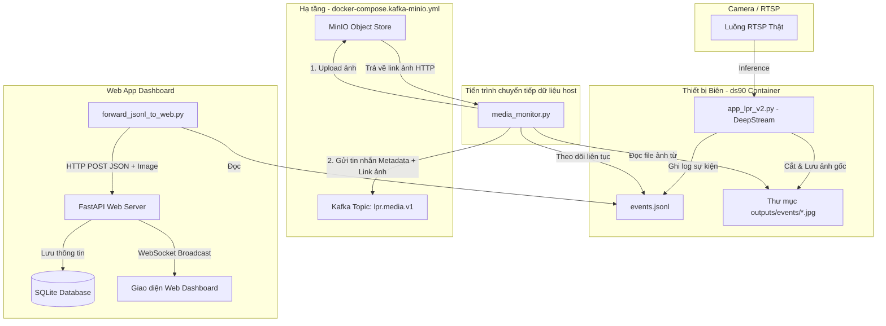

# Hướng Dẫn Tích Hợp Kafka & MinIO và Hướng Dẫn Vận Hành Hệ Thống (Đã Sửa Lỗi)

Tài liệu này giải thích chi tiết kiến trúc tích hợp hệ thống nhận diện biển số xe (LPR) thời gian thực sử dụng **DeepStream**, **MinIO (Lưu trữ ảnh)**, **Kafka/Redpanda (Hàng đợi tin nhắn)** và **FastAPI Web Dashboard**.

---

## 1. Sơ đồ Kiến trúc & Luồng Dữ liệu

Trong hệ thống giám sát này:
* **MinIO** đóng vai trò là kho lưu trữ file ảnh (để tránh làm phình cơ sở dữ liệu SQL).
* **Kafka (Redpanda)** đóng vai trò là kênh truyền tin nhắn bất đồng bộ tốc độ cao.
* **FastAPI Server** quản lý cơ sở dữ liệu SQLite và truyền thông tin thời gian thực qua WebSockets lên giao diện Web Dashboard.



### Cơ chế hoạt động:
1. **DeepStream (`app_lpr_v2.py`)**: Đọc luồng RTSP, nhận diện xe & biển số, ghi thông tin vào `events.jsonl` và lưu các ảnh cắt vào thư mục `outputs/events/`.
2. **MinIO (S3-Compatible Object Store)**: Lưu trữ các ảnh cắt (Plate, Vehicle, Frame). Khi tải ảnh lên thành công, MinIO cung cấp đường dẫn HTTP tĩnh công khai.
3. **Kafka / Redpanda**: Script `media_monitor.py` đóng gói dữ liệu JSON của sự kiện kèm link ảnh từ MinIO rồi gửi vào topic Kafka `lpr.media.v1` để các ứng dụng khác tiêu thụ.
4. **Web Server Dashboard**: Nhận dữ liệu thông qua HTTP POST từ `forward_jsonl_to_web.py`, lưu vào SQLite và cập nhật giao diện web thời gian thực qua WebSocket.

---

## 2. Hướng dẫn từng bước chạy thực tế bằng dòng lệnh

Hãy mở các cửa sổ Terminal riêng biệt để chạy từng thành phần của hệ thống:

### Cửa sổ 1: Khởi động Hạ tầng (Kafka, MinIO) & Web Server Dashboard

Khởi động container chứa Redpanda (Kafka-compatible) + MinIO và khởi động Web Server:

```bash
# 1. Khởi động Kafka & MinIO
cd /home/thagn/projects/deepstream/workspace/last_ds_cp
docker compose -f docker-compose.kafka-minio.yml up -d

# 2. Khởi động Web Server Dashboard (cổng 8000)
cd /home/thagn/projects/deepstream/workspace/last_ds_cp/web_server
docker compose up --build -d
```

> **Thông tin truy cập:**
> * Giao diện Web Dashboard: [http://localhost:8000](http://localhost:8000)
> * Giao diện MinIO Console: [http://localhost:9001](http://localhost:9001) (User/Pass: `minioadmin` / `minioadmin`)

---

### Cửa sổ 2: Tạo luồng RTSP thật trên máy Host

Giả lập camera RTSP bằng cách stream lặp lại toàn bộ video trong thư mục bằng `MediaMTX` và `FFmpeg`:

```bash
cd /home/thagn/projects/deepstream/workspace/last_ds_cp
./scripts/run_rtsp.sh
```

Script sẽ stream tất cả file `.mp4` trong `videos/drive-download-20260616T102510Z-3-001/` và in ra URL để dùng ở bước sau. Ví dụ:

```
rtsp://172.17.0.1:8554/drive-download-20260616T102510Z-3-001/lpr_230428_001
rtsp://172.17.0.1:8554/drive-download-20260616T102510Z-3-001/lpr_230428_002
...
```

---

### Cửa sổ 3: Khởi chạy DeepStream Pipeline (`app_lpr_v2.py`)

Chạy ứng dụng DeepStream bên trong container `ds90`. Cờ `--no-display` là **bắt buộc** khi chạy trong container không có màn hình. Có thể truyền nhiều URL RTSP cùng lúc (mỗi URL là 1 luồng camera độc lập):

```bash
# Đầu tiên, truy cập vào trong container ds90:
docker exec -it ds90 bash

# Chuyển đến thư mục làm việc:
cd /workspace/last_ds

# Chạy ứng dụng:
python3 src/app_lpr_v2.py \
    rtsp://127.0.0.1:8554/drive-download-20260616T102510Z-3-001/lpr_230428_001 \
    rtsp://127.0.0.1:8554/drive-download-20260616T102510Z-3-001/lpr_230428_001 \
    videos/test1.h264 \
    videos/test3.h264 \
    --output outputs/test_last.mp4 \
    --event-output-dir /outputs/events \
    --event-jsonl /outputs/events/events.jsonl \
    --save-event-frame \
    --min-stable-votes 2 \
    --pgie-interval 0
```

> **Lưu ý:** File `events.jsonl` và ảnh cắt sẽ được lưu vào `outputs/events/` với quyền `root` (do container ds90 chạy với quyền root). Xem bước fix quyền ở Cửa sổ 4 & 5.

---

### Cửa sổ 4: Đồng bộ dữ liệu lên Web Server Dashboard

Chạy script forwarder để theo dõi file `events.jsonl` và đẩy lên giao diện Web theo thời gian thực.

**Lỗi đã sửa:**
- Phải cài `requests` trước.
- Phải dùng `--path-map` để ánh xạ đường dẫn container (`/workspace/last_ds_cp`) sang đường dẫn host (`/home/thagn/projects/deepstream/workspace/last_ds_cp`) — nếu thiếu thì ảnh sẽ không gửi được (`missing_files=3`).

```bash
# Cài thư viện nếu chưa có
pip install requests

cd /home/thagn/projects/deepstream/workspace/last_ds_cp/web_server
python3 forward_jsonl_to_web.py \
    --events-jsonl /home/thagn/projects/deepstream/outputs/events/events.jsonl \
    --path-map "/outputs=/home/thagn/projects/deepstream/outputs"
```

*(Mở trình duyệt tại [http://localhost:8000](http://localhost:8000) để xem kết quả trên Dashboard)*

---

### Cửa sổ 5: Đồng bộ dữ liệu lên MinIO & Kafka

Chạy script media monitor để upload ảnh lên MinIO và bắn tin nhắn vào Kafka.

**Lỗi đã sửa:**
- Thư mục `outputs/events/` do container ds90 (chạy với root) tạo ra, nên host user không thể ghi file `media_results.jsonl`. Cần cấp quyền ghi trước.

```bash
cd /home/thagn/projects/deepstream/workspace/last_ds_cp

# Cài đặt thư viện nếu chưa có
pip install minio confluent-kafka

# Fix quyền thư mục outputs/events/ (chỉ cần làm 1 lần)
sudo chmod o+w /home/thagn/projects/deepstream/outputs/events/

# Chạy giám sát và upload
./scripts/run_media_monitor_minio.sh
```

Kiểm tra kết quả upload trên MinIO Console: [http://localhost:9001](http://localhost:9001)

---

## 3. Kiểm tra hệ thống đang hoạt động

### Kiểm tra container đang chạy:
```bash
docker ps --format "table {{.Names}}\t{{.Status}}\t{{.Ports}}"
```

Kết quả mong đợi:
```
NAMES                STATUS          PORTS
edge_event_monitor   Up X minutes    0.0.0.0:8000->8000/tcp
minio                Up X minutes
redpanda             Up X minutes
mediamtx             Up X minutes
ds90                 Up X minutes
```

### Kiểm tra events.jsonl có dữ liệu:
```bash
wc -l /home/thagn/projects/deepstream/outputs/events/events.jsonl
tail -1 /home/thagn/projects/deepstream/outputs/events/events.jsonl | python3 -m json.tool | head -20
```

### Kiểm tra Kafka có nhận tin nhắn (chạy từ host):
```bash
docker exec redpanda rpk topic consume lpr.media.v1 --brokers 127.0.0.1:9092 -n 3
```

### Kiểm tra MinIO bucket có ảnh:
```bash
docker run --rm --network host minio/mc:latest \
    sh -c 'mc alias set local http://127.0.0.1:9000 minioadmin minioadmin && mc ls local/lpr-media --recursive | head -10'
```

---

## 4. Tổng hợp lỗi đã phát hiện & sửa

| Bước | Lỗi gốc | Nguyên nhân | Cách sửa |
|------|----------|-------------|----------|
| Cửa sổ 4 | `ModuleNotFoundError: No module named 'requests'` | Thiếu bước cài thư viện | Thêm `pip install requests` |
| Cửa sổ 4 | `missing_files=3` — ảnh không được gửi | Thiếu `--path-map` → script không tìm được file ảnh vì đường dẫn là dạng container `/workspace/...` | Thêm `--path-map "/workspace/last_ds_cp=<host_path>"` |
| Cửa sổ 5 | `Permission denied: 'outputs/events/media_results.jsonl'` | Thư mục `outputs/events/` được tạo bởi container ds90 (root) nên host user không có quyền ghi | Chạy `sudo chmod o+w outputs/events/` trước |
| Cửa sổ 3 | Chỉ stream 1 URL nhưng RTSP server phát tất cả 15 video | Hướng dẫn cũ chỉ dùng 1 URL cứng | Liệt kê nhiều URL hoặc dùng script để lấy URL tự động |
