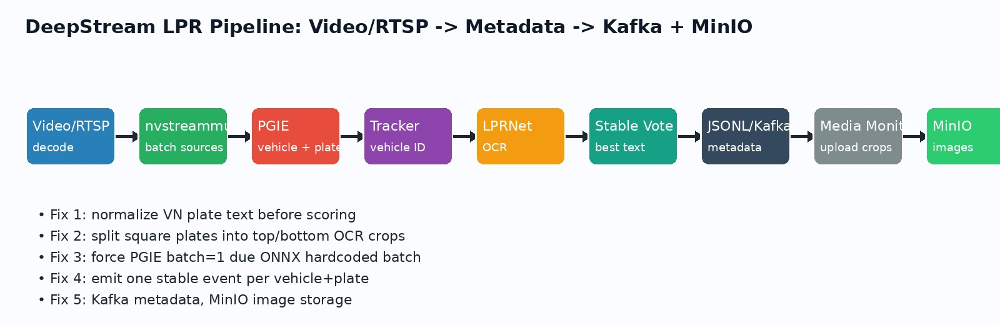
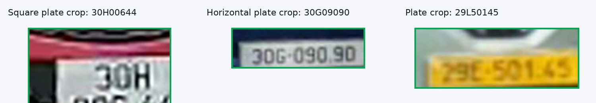
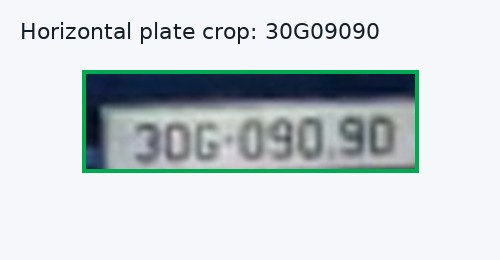
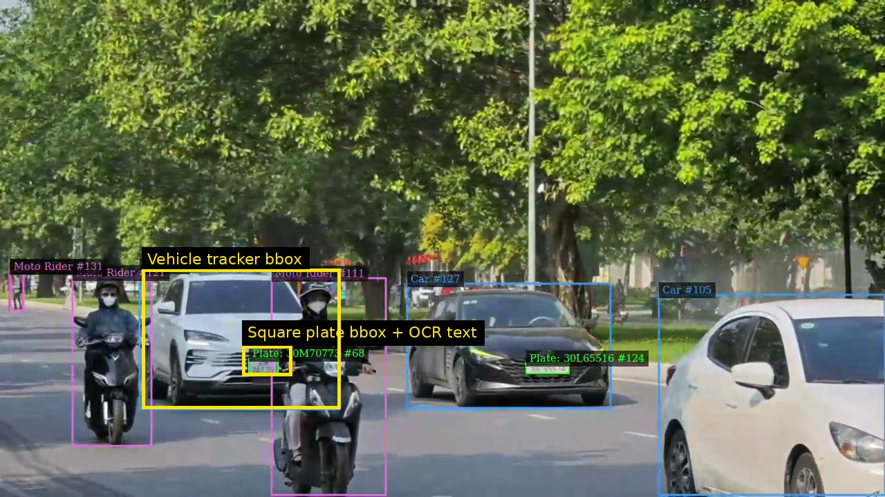
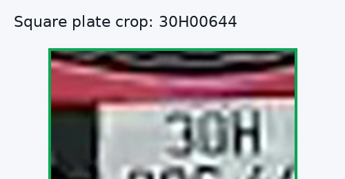
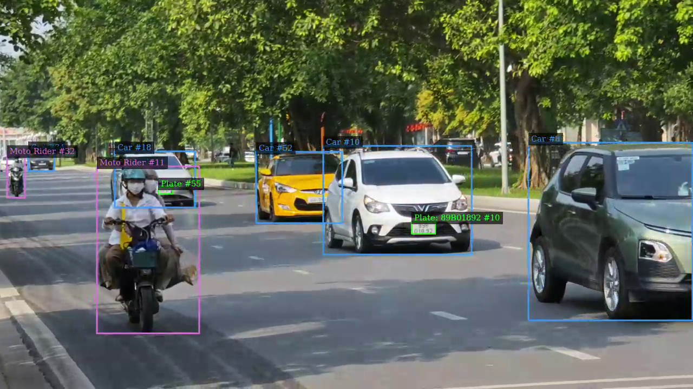
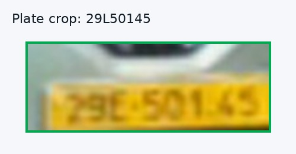
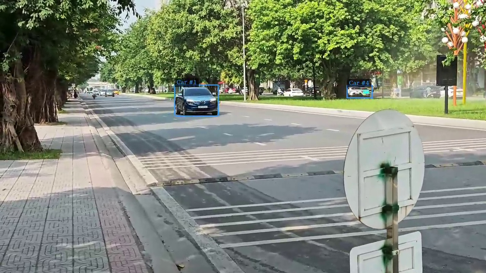
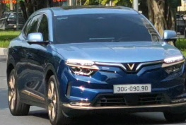
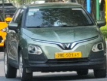

# DeepStream LPR Pipeline - Bug Fix Report Slides

File này là bản nội dung slide để copy sang PowerPoint/Google Slides.
Ảnh minh họa nằm trong `reports/assets/`; phần ảnh dẫn xuất đều được tạo từ ảnh/crop thật trong repo.

---

## Slide 1 - Mục tiêu dự án



**Bài toán**

- Nhận diện xe và biển số từ video/RTSP bằng DeepStream 9.0.
- OCR biển số bằng LPRNet.
- Gắn kết quả OCR với đúng xe, đúng tracker ID, đúng frame/source.
- Gửi metadata lên Kafka và gửi ảnh crop lên MinIO.

**Pipeline cuối**

```text
Video/RTSP -> PGIE detect xe/biển -> Tracker -> LPRNet OCR
           -> stable vote -> event JSON/Kafka -> media monitor -> MinIO
```

**Speaker notes**

Mục tiêu không chỉ là vẽ bbox lên màn hình, mà là tạo event đủ sạch để backend có thể dùng: xe nào, biển nào, tracker ID nào, frame nào, ảnh crop nào.

---

## Slide 2 - Khó khăn ban đầu: OCR raw bị nhiễu ký tự



**Hiện tượng**

- LPRNet OCR dễ nhầm ký tự có hình dạng gần nhau.
- Ví dụ kiểu lỗi:
  - `O` nhầm `0`
  - `S` nhầm `5`
  - `B` nhầm `8`
  - `D` nhầm `0`
- Nếu chấm điểm trực tiếp text raw, hệ thống có thể chọn biển sai dù biển thật có pattern Việt Nam rõ ràng.

**Fix**

Thêm nhóm hàm chuẩn hóa và sửa ký tự theo vị trí:

- `_normalize_plate_for_output(raw)`
- `_fix_char_at(ch, want_digit)`
- `_correct_vn_plate(raw)`
- `_plate_pattern_score(text)`

**Code chính**

```python
_LETTER_TO_DIGIT = {'B':'8','D':'0','G':'6','I':'1','O':'0','S':'5'}
_DIGIT_TO_LETTER = {'8':'B','0':'D','6':'G','5':'S','7':'T'}

def _correct_vn_plate(raw):
    # 2 ký tự đầu: ưu tiên số tỉnh
    # series: ưu tiên chữ
    # suffix: ưu tiên số
```

**Ví dụ**

```text
Raw OCR       : 3OH1234S
Sau correction: 30H12345
```

**Speaker notes**

Điểm quan trọng là correction không sửa bừa toàn chuỗi. Nó sửa theo cấu trúc biển Việt Nam: 2 số đầu, 1-2 chữ series, 4-5 số cuối.

---

## Slide 3 - Cách chấm điểm biển số tốt nhất



**Khó khăn**

Một object biển số có thể có nhiều candidate OCR qua nhiều frame. Không thể lấy kết quả mới nhất một cách mù quáng.

**Fix**

Hàm `_plate_quality_score()` kết hợp nhiều yếu tố:

```python
score = _plate_pattern_score(text)
score += conf * 2.0
score += size_factor
score += association_score
```

**Các thành phần điểm**

- Pattern biển Việt Nam hợp lệ.
- Confidence OCR.
- Kích thước bbox biển số đủ lớn.
- Biển gắn được vào xe bằng parent/geometry.

**Kết quả**

- OCR rác, sai format sẽ bị score `0`.
- Candidate đúng format, confidence cao, bbox rõ hơn sẽ thắng.

**Speaker notes**

Đây là bước chuyển từ “OCR đọc được gì thì tin đó” sang “OCR phải qua bộ lọc logic nghiệp vụ biển số Việt Nam”.

---

## Slide 4 - Bug biển vuông 2 dòng không OCR đúng dòng đầu



**Hiện tượng**

- Biển vuông 2 dòng có bbox detect được.
- Nhưng OCR hay thiếu dòng đầu hoặc đọc thêm ký tự nhiễu giữa hai dòng.
- Ví dụ từng gặp:

```text
top OCR: 30HT
bot OCR: 00644
candidate xấu: 30HT00644
candidate tốt: 30H00644
```

**Root cause**

LPRNet input là crop nhỏ theo bbox biển. Với biển vuông, nếu OCR cả biển một lần thì hai dòng bị dính nhau hoặc khoảng trắng giữa dòng bị đọc thành ký tự như `T`.

**Fix**

Trong `sgie3_sink_pad_buffer_probe()`:

- Nếu aspect ratio biển `< _square_plate_ar_threshold`.
- Tạo pseudo-object cho top crop và bottom crop.
- Cho LPRNet OCR từng dòng.
- Ghép lại bằng `_square_join_variants(top, bot)`.

**Code ý tưởng**

```python
if ar < _square_plate_ar_threshold:
    # add pseudo top object
    # add pseudo bottom object

for joined in _square_join_variants(t_txt, b_txt):
    _add_candidate(joined, avg_conf)
```

**Speaker notes**

Fix này không cần train lại model. Mình tận dụng DeepStream metadata để tạo thêm crop OCR cho dòng trên/dòng dưới trước khi vào SGIE LPRNet.

---

## Slide 5 - Fix extra character trên biển vuông



**Bug cụ thể**

LPRNet đôi khi đọc vùng phân cách giữa 2 dòng thành ký tự thừa:

```text
Sai : 30HT00644
Đúng: 30H00644
```

**Fix trong `_square_join_variants()`**

- Với biển vuông, dòng trên thường là:

```text
2 số tỉnh + 1 chữ series
```

- Nếu top row dài hơn 3 ký tự nhưng 3 ký tự đầu đã tạo prefix hợp lệ, thêm candidate đã trim:

```python
province_series = top[:3]
_push(province_series + bot)
```

**Kết quả test**

Event từ stream `lpr_230428_003`:

```json
{
  "plate_text_raw": "30H00644",
  "plate_text_stable": "30H00644",
  "vehicle_class_name": "Car",
  "association_method": "geometry"
}
```

**Speaker notes**

Mình không xóa ký tự thừa trong mọi trường hợp. Chỉ áp dụng khi prefix 3 ký tự đầu đã đúng format tỉnh + series, tránh làm hỏng biển 2-letter series.

---

## Slide 6 - Bug OCR bị nhảy theo frame



**Hiện tượng**

Xe đang chạy, biển nhỏ hoặc motion blur làm OCR thay đổi giữa các frame:

```text
Frame A: 30L0053
Frame B: 30L0052
Frame C: 30L0052
```

Nếu gửi từng frame lên server sẽ gây spam và sai dữ liệu.

**Fix**

Thêm stable voting theo `track_key = (source_id, vehicle_tracker_id)`:

```python
hist.append({"text": norm, "score": score})
```

Sau đó gom các text gần giống nhau:

```python
_plate_similar_enough()
Levenshtein distance <= 1
```

**Kết quả**

- Các OCR gần giống được gom vote.
- Text stable chỉ cập nhật khi đủ tốt.
- Không phát event cho OCR rác từng frame.

**Speaker notes**

Với video realtime, một biển số không phải lúc nào cũng rõ. Stable vote giúp hệ thống có trí nhớ ngắn hạn theo tracker ID.

---

## Slide 7 - Bug stable text drift



**Hiện tượng**

Một số trường hợp OCR mới có nhiều vote hơn nhưng pattern kém hơn hoặc lệch tỉnh/series, làm stable text bị đổi sai.

**Root cause**

Voting đơn thuần có thể bị lệch nếu nhiều frame bị blur cùng kiểu.

**Fix**

Hàm `_should_replace_stable_text()` thêm drift guard:

```python
if major_change and new_pattern < current_pattern:
    return False
```

Và tăng margin khi thay đổi lớn:

```python
vote_margin = base_margin + 2
score_margin = base_margin + 1.0
```

**Kết quả**

- Biển đã stable không bị thay bởi candidate có pattern tệ hơn.
- Chỉ cập nhật nếu candidate mới thật sự tốt hơn.

**Speaker notes**

Đây là lớp bảo vệ cuối cùng: không để OCR “ảo giác” từ một vài frame làm đổi biển đã xác nhận.

---

## Slide 8 - Bug multi-stream: source 2/3 không có bbox



**Hiện tượng**

Khi chạy 3-4 stream, chỉ stream đầu có bbox; các stream sau ít hoặc không detect.

**Root cause**

Model `vehicle_parking_detect.onnx` có output hardcode:

```text
[1, 8400, 6]
```

Trong graph còn có nhiều `Reshape` hardcode batch=1, ví dụ:

```text
[1, 64, -1]
[1, 4, 16, 8400]
```

Nếu chỉ patch metadata output thành `batch`, TensorRT vẫn có thể xử lý sai ngầm vì node reshape bên trong vẫn batch=1.

**Fix production tạm thời**

Ép PGIE batch-size=1:

```python
streammux.set_property("batch-size", num_sources)
pgie.set_property("batch-size", 1)
```

**Trade-off**

- Đúng bbox cho mọi source.
- Hiệu suất thấp hơn batching thật.
- Muốn tối ưu sau này cần re-export ONNX dynamic batch từ PyTorch.

**Speaker notes**

Đây là bug nguy hiểm vì không crash, không warning rõ; chỉ âm thầm mất detection ở stream sau.

---

## Slide 9 - Bug crop sai khi lấy ảnh sau tiler



**Hiện tượng**

Nếu crop ảnh sau `nvmultistreamtiler`, frame đã bị ghép lưới và scale nhỏ, ảnh biển bị mờ hoặc sai tọa độ.

**Fix**

Chuyển metadata/crop probe lên trước tiler:

```text
SGIE LPRNet -> nvvideoconvert -> caps_gpu RGBA
             -> metadata_src_pad_buffer_probe
             -> tiler -> nvosd
```

Trong code:

```python
frame_image = pyds.get_nvds_buf_surface(...)
```

Lấy được frame gốc từng stream để crop:

```python
crop_plate_path
crop_vehicle_path
```

**Kết quả**

- Crop biển/xe đúng từ frame gốc.
- `source_id` vẫn đúng trước tiler.
- Dữ liệu ảnh sẵn sàng upload MinIO.

**Speaker notes**

Tiler chỉ nên phục vụ hiển thị. Metadata server và crop ảnh nên lấy trước tiler để không mất chất lượng.

---

## Slide 10 - Bug metadata thiếu quan hệ “biển thuộc xe nào”


**Yêu cầu backend**

Server cần biết:

- Biển số này thuộc xe nào.
- Tracker ID bao nhiêu.
- Frame/source nào.
- Crop ảnh biển và xe nằm ở đâu.

**Fix**

Tạo `VehicleTrackState` theo key:

```python
(source_id, vehicle_tracker_id)
```

Liên kết biển với xe bằng:

1. Parent object từ DeepStream nếu có.
2. Fallback geometry overlap nếu không có parent.

Event cuối có schema:

```json
{
  "vehicle": {
    "tracker_id": "...",
    "class_name": "Car",
    "bbox": [...]
  },
  "plate": {
    "text_stable": "30H00644",
    "bbox": [...]
  },
  "association": {
    "method": "geometry",
    "score": 1.0
  }
}
```

**Speaker notes**

Đây là khác biệt giữa demo CV và hệ thống production: backend không chỉ cần text biển, mà cần quan hệ text-biển-xe-frame.

---

## Slide 11 - Chống spam event gửi server



**Vấn đề**

Nếu mỗi frame stable đều gửi Kafka/API, server nhận quá nhiều event lặp:

```text
cùng xe, cùng biển, frame 100
cùng xe, cùng biển, frame 101
cùng xe, cùng biển, frame 102
```

**Fix**

Dedup key:

```python
event_key = (source_id, vehicle_tracker_id, stable_text)
```

Mặc định:

- Event key chưa gửi -> emit.
- Event key đã gửi -> bỏ qua.
- Chỉ gửi lại nếu bật:

```bash
--emit-duplicates
--event-repeat-cooldown-frames N
```

**Kết quả**

Server nhận một event sạch cho mỗi xe + biển, thay vì hàng chục event rác.

**Speaker notes**

Mình tách “hiển thị realtime” và “event gửi server”. Hiển thị có thể update liên tục, nhưng server chỉ nhận event đủ stable và không lặp.

---

## Slide 12 - Kafka + MinIO production flow


**Flow hiện tại**

```text
DeepStream app
  -> events.jsonl
  -> Kafka topic: lpr.events.v1

media_monitor.py
  -> đọc events.jsonl
  -> upload ảnh lên MinIO
  -> media_results.jsonl
  -> Kafka topic: lpr.media.v1
```

**Vì sao không gửi ảnh vào Kafka?**

- Kafka chỉ gửi metadata nhỏ.
- Ảnh binary để MinIO/S3 quản lý.
- Backend nhận URL ảnh từ `lpr.media.v1`.

**MinIO object key**

```text
lpr/{source_id}/{event_id}/plate.jpg
lpr/{source_id}/{event_id}/vehicle.jpg
```

**Speaker notes**

Kafka là message bus, MinIO là object storage. Tách hai phần giúp pipeline không bị nghẽn vì upload ảnh.

---

## Slide 13 - Kết quả test tiêu biểu


**Stream `lpr_230428_003`**

```json
{
  "source_uri": "rtsp://172.17.0.1:8554/.../lpr_230428_003",
  "vehicle_class_name": "Car",
  "plate_text_raw": "30H00644",
  "plate_text_stable": "30H00644",
  "ocr_confidence": 0.9542,
  "association_method": "geometry"
}
```

**Kafka/MinIO E2E**

- `lpr.events.v1`: nhận metadata OCR.
- `lpr.media.v1`: nhận media result.
- MinIO bucket `lpr-media`: có `plate.jpg` và `vehicle.jpg`.

**Speaker notes**

Đây là bằng chứng flow từ DeepStream đến Kafka và MinIO đã chạy thật, không chỉ ghi JSON local.

---

## Slide 14 - Những trade-off còn lại

**1. PGIE batch=1**

- Ưu điểm: đúng detection mọi stream.
- Nhược điểm: throughput thấp hơn batch thật.
- Roadmap: re-export ONNX dynamic batch chuẩn.

**2. Media monitor vẫn đọc JSONL**

- Hiện tại JSONL là cầu nối local.
- Roadmap: thêm mode consume Kafka trực tiếp từ `lpr.events.v1`.

**3. OCR với biển rất nhỏ/motion blur**

- Đã có confidence/size filter và stable voting.
- Nhưng model vẫn có giới hạn khi biển quá mờ hoặc quá nhỏ.

**4. RTSP loop reset tracker ID**

- Với clip loop ngắn, tracker ID reset làm vote history reset.
- Roadmap: persistence theo source + plate similarity trong thời gian ngắn.

**Speaker notes**

Phần này thể hiện mình hiểu giới hạn hiện tại, không trình bày như hệ thống đã hoàn hảo tuyệt đối.

---

## Slide 15 - Tổng kết đóng góp kỹ thuật

**Các bug đã xử lý**

1. OCR raw nhiễu ký tự -> correction theo format biển Việt Nam.
2. Biển vuông không đọc đủ 2 dòng -> split top/bottom pseudo-object.
3. Extra `T` giữa 2 dòng -> trim candidate thông minh.
4. OCR nhảy theo frame -> stable vote + Levenshtein clustering.
5. Stable text drift -> guard không thay biển bằng candidate kém hơn.
6. Multi-stream mất bbox -> ép PGIE batch=1 vì ONNX hardcode batch.
7. Crop sai do tiler -> chuyển probe/crop trước tiler.
8. Metadata thiếu quan hệ xe-biển -> `VehicleTrackState` + association.
9. Spam event server -> dedup theo source + tracker + plate.
10. Production output -> Kafka metadata + MinIO image upload.

**Kết quả**

- Pipeline LPR chạy được file/RTSP.
- Event có đủ xe, biển, tracker ID, frame, source, crop path.
- Kafka và MinIO đã test end-to-end.
