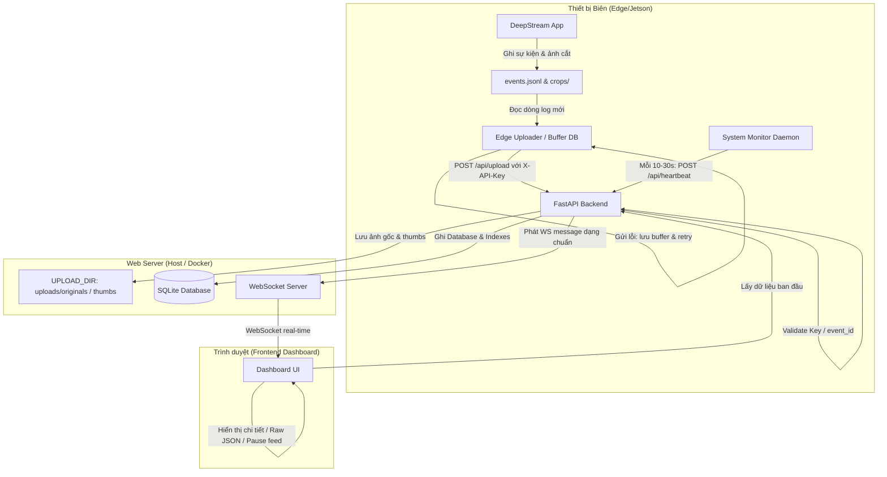
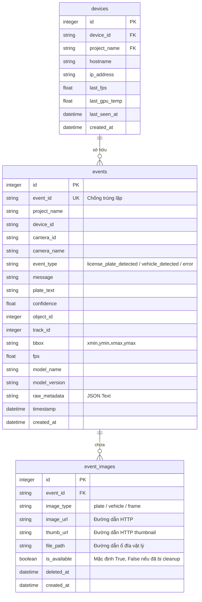

# Kế hoạch Thiết kế và Triển khai Hệ thống Edge Event Monitoring Dashboard (Bản hoàn thiện)

Hệ thống giám sát trung tâm được thiết kế để phục vụ việc nhận sự kiện, hình ảnh cắt và dữ liệu vận hành từ nhiều thiết bị biên (như các thiết bị NVIDIA Jetson chạy DeepStream) theo cách bảo mật, thời gian thực, có khả năng phục hồi lỗi mạng và dọn dẹp dung lượng tự động.

---

## 1. Luồng Chạy của Hệ thống (Standardized Run Flow)



---

## 2. Thiết kế Database Schema (SQLite)

Cơ sở dữ liệu được tối ưu hóa bằng các ràng buộc khóa ngoại, chỉ mục (indexes) để đảm bảo tốc độ truy vấn khi số lượng sự kiện tăng lên hàng trăm nghìn.



### Ràng buộc và Chỉ mục (Indexes & Constraints)
* **Devices**: Ràng buộc duy nhất trên cặp thiết bị và dự án: `UNIQUE(device_id, project_name)`.
* **Indexes**:
  - `idx_events_timestamp`: `events(timestamp DESC)` -> Tối ưu hóa việc sắp xếp danh sách sự kiện mới nhất.
  - `idx_events_search`: `events(project_name, device_id, timestamp DESC)` -> Tăng tốc bộ lọc trên Dashboard.
  - `idx_events_plate`: `events(plate_text)` -> Tìm kiếm nhanh theo biển số xe.
  - `idx_event_images_event_id`: `event_images(event_id)` -> Tăng tốc kết xuất ảnh liên quan của một sự kiện.
  - `idx_devices_last_seen`: `devices(last_seen_at)` -> Kiểm tra nhanh thiết bị ngoại tuyến (offline).

---

## 3. Đặc tả API Endpoints

### 3.1. Xác thực (Security)
Tất cả các endpoint ghi dữ liệu (`POST /api/upload`, `POST /api/heartbeat`) đều kiểm tra header `X-API-Key`.
Nếu API key không hợp lệ hoặc thiếu, API trả về mã lỗi `401 Unauthorized`.

### 3.2. Danh sách Endpoints

| Method | Endpoint | Định dạng Yêu cầu | Mục đích |
| :--- | :--- | :--- | :--- |
| **POST** | `/api/upload` | `multipart/form-data` | Nhận thông tin sự kiện cùng file ảnh (`plate_image`, `vehicle_image`, `frame_image`). Kiểm tra trùng lặp `event_id`. |
| **POST** | `/api/heartbeat` | `application/json` | Nhận dữ liệu trạng thái thiết bị biên (FPS, GPU Temp...). Cập nhật `last_seen_at` của thiết bị. |
| **GET** | `/api/events` | Query params | Lấy danh sách lịch sử sự kiện hỗ trợ phân trang (`limit`, `offset`) và lọc theo `project_name`, `device_id`, `camera_id`, `event_type`, `plate_text`, khoảng thời gian (`from_time`, `to_time`). |
| **GET** | `/api/events/{event_id}` | Path variable | Trả về thông tin chi tiết của một sự kiện (bao gồm cả trường dữ liệu gốc `raw_metadata`). |
| **GET** | `/api/devices` | Không có | Lấy danh sách các thiết bị biên, tính toán trạng thái online dựa trên: `now - last_seen_at <= HEARTBEAT_TIMEOUT_SECONDS` (mặc định 60s). |
| **GET** | `/api/projects` | Không có | Lấy danh sách tất cả các dự án đang hoạt động. |
| **GET** | `/api/stats` | Không có | Lấy các chỉ số thống kê trong ngày (Tổng số sự kiện, Số thiết bị online/offline, Số sự kiện theo từng thiết bị). |
| **GET** | `/health` | Không có | Kiểm tra hoạt động của Web Server. |
| **WS** | `/ws` | Giao thức WebSocket | Đẩy tin nhắn theo định dạng chuẩn hóa tới Frontend. |

---

## 4. Chuẩn hóa Định dạng WebSocket Messages

Dữ liệu truyền qua WebSocket sẽ được chuẩn hóa dưới dạng JSON có cấu trúc `{"type": "...", "data": {...}}`:

1. **Sự kiện mới (`event_created`)**:
   ```json
   {
     "type": "event_created",
     "data": {
       "event_id": "Jetson-01-cam-02-20260619T172851-000123",
       "project_name": "DeepStream-LPR-V2",
       "device_id": "Jetson-01",
       "camera_name": "Gate A",
       "event_type": "license_plate_detected",
       "message": "Đã nhận diện biển số 30F-999.99",
       "plate_text": "30F-999.99",
       "confidence": 0.95,
       "timestamp": "2026-06-19T17:28:51+07:00",
       "images": {
         "plate_image_url": "/uploads/thumbs/plate_uuid.jpg",
         "vehicle_image_url": "/uploads/thumbs/vehicle_uuid.jpg"
       }
     }
   }
   ```

2. **Cập nhật Heartbeat (`device_heartbeat`)**:
   ```json
   {
     "type": "device_heartbeat",
     "data": {
       "device_id": "Jetson-01",
       "project_name": "DeepStream-LPR-V2",
       "status": "online",
       "fps": 28.5,
       "gpu_temp": 62.0,
       "last_seen_at": "2026-06-19T17:28:55+07:00"
     }
   }
   ```

3. **Thiết bị mất kết nối (`device_offline`)**:
   ```json
   {
     "type": "device_offline",
     "data": {
       "device_id": "Jetson-02",
       "project_name": "DeepStream-LPR-V2",
       "last_seen_at": "2026-06-19T17:27:00+07:00"
     }
   }
   ```

---

## 5. Cơ chế Quản lý Tài nguyên & Retention Policy

### 5.1. Thống nhất đường dẫn lưu trữ
Hệ thống sử dụng một biến môi trường duy nhất là `UPLOAD_DIR` (Ví dụ `/app/uploads`). Thư mục này được chia thành hai nhánh con:
* `uploads/originals/`: Nơi lưu ảnh gốc chất lượng cao từ thiết bị biên gửi lên.
* `uploads/thumbs/`: Nơi chứa ảnh thumbnails (chiều rộng tối đa 300px, nén chất lượng 80%) được tự động tạo bởi server sử dụng thư viện `Pillow` khi ảnh được tải lên.

### 5.2. Vòng đời ảnh & Tác vụ dọn dẹp định kỳ
* **is_available**: Khi dọn dẹp ảnh gốc cũ (ví dụ hơn 7 ngày), hệ thống sẽ xóa file vật lý trên ổ đĩa và cập nhật trường `is_available = False` và `deleted_at = datetime.now()` trong bảng `event_images`.
* Giao diện Frontend khi nhận thấy `is_available == False` sẽ hiển thị thông báo thay thế ảnh: *"Ảnh gốc đã được dọn dẹp tự động để tiết kiệm dung lượng"*.
* **Cơ chế tác vụ định kỳ**:
  FastAPI khởi tạo một async task chạy nền khi ứng dụng startup (`@app.on_event("startup")`), thực hiện kiểm tra dọn dẹp mỗi 1 giờ để không ảnh hưởng đến hiệu năng của API chính.

---

## 6. Giao diện Frontend (Cải tiến & Event Detail)

* **Phân loại màu sắc theo Event Type**:
  - `license_plate_detected` -> Viền màu Xanh lá (Emerald) nổi bật.
  - `vehicle_detected` -> Viền màu Tím (Indigo).
  - `error` / `alert` -> Viền màu Đỏ (Rose).
  - `system_status` -> Viền màu Xám (Slate).
* **Nút điều khiển Feed**: Nút `Pause Live` để tạm dừng trượt màn hình khi có sự kiện mới, nút `Resume Live` để tiếp tục, và nút `Clear View` để dọn trống màn hình hiện tại.
* **Chi tiết sự kiện (Event Detail Drawer/Modal)**:
  Khi click vào bất kỳ card sự kiện nào, một Panel chi tiết bên phải (Drawer) hoặc một Modal sẽ trượt ra hiển thị:
  - Tất cả thông tin metadata đầy đủ: ID sự kiện, Camera Name, Confidence, Model Name & Version.
  - Ảnh toàn cảnh (Frame) ở dạng lớn hơn.
  - **Raw JSON**: Phần mã JSON gốc gửi từ thiết bị biên được định dạng đẹp (pretty-printed JSON) giúp việc gỡ lỗi DeepStream cực kỳ dễ dàng.

---

## 7. Cấu trúc Docker Compose Chuẩn

`docker-compose.yml`
```yaml
version: "3.8"

services:
  web_server:
    build:
      context: .
      dockerfile: Dockerfile
    container_name: edge_event_monitor
    ports:
      - "8000:8000"
    volumes:
      - ./data:/app/data
      - ./uploads:/app/uploads
    environment:
      - DATABASE_URL=sqlite:////app/data/events.db
      - UPLOAD_DIR=/app/uploads
      - API_KEY_WHITELIST=Jetson-Xavier-NX-01=secret_key_nx_01,Jetson-Orin-02=secret_key_orin_02
      - RETENTION_DAYS=7
      - MAX_UPLOAD_MB=5
      - HEARTBEAT_TIMEOUT_SECONDS=60
    restart: unless-stopped
```

---

## 8. Lộ trình Triển khai (Roadmap 3 Giai đoạn)

### Giai đoạn 1: Xây dựng Core MVP (Thời gian thực & API Cốt lõi)
* [ ] Thiết lập khung dự án, cơ sở dữ liệu SQLite (3 bảng kèm các index).
* [ ] Triển khai các API lấy dữ liệu ban đầu: `POST /api/upload`, `GET /api/events`, `GET /api/devices`, `GET /api/stats`.
* [ ] Thiết lập WebSocket `/ws` đẩy tin nhắn theo định dạng chuẩn hóa.
* [ ] Viết giao diện Frontend Dashboard cơ bản: Live Event Feed (trượt tự động), click xem ảnh phóng to, bộ lọc Project/Device.
* [ ] Viết script `test_client.py` giả lập nhiều thiết bị biên gửi sự kiện liên tục.

### Giai đoạn 2: Tối ưu vận hành & An toàn dữ liệu
* [ ] Bổ sung xác thực `X-API-Key` cho API upload và heartbeat.
* [ ] Triển khai API `/api/heartbeat` cập nhật trạng thái thiết bị định kỳ, hiển thị bảng Device Status trên Frontend.
* [ ] Xây dựng giải pháp Retry & Buffer cho Edge client sử dụng SQLite local trên Jetson.
* [ ] Phát triển background task (async startup task) tạo ảnh thumbnails và dọn dẹp ảnh gốc dựa trên retention policy, cập nhật trạng thái `is_available` cho ảnh.
* [ ] Đóng gói toàn bộ mã nguồn vào Docker Compose chạy ở chế độ `unless-stopped`.

### Giai đoạn 3: Mở rộng hệ thống (Định hướng tương lai)
* [ ] Chuyển đổi SQLite sang PostgreSQL và sử dụng MinIO/S3 lưu trữ file ảnh gốc khi hệ thống chạy ở quy mô lớn.
* [ ] Thay thế WebSocket manager nội tại của FastAPI bằng Redis Pub/Sub để hỗ trợ scale-out ngang.
* [ ] Tích hợp tính năng quản lý người dùng, phân quyền đăng nhập và cảnh báo sự kiện ra các kênh ngoài (Telegram, Email).
