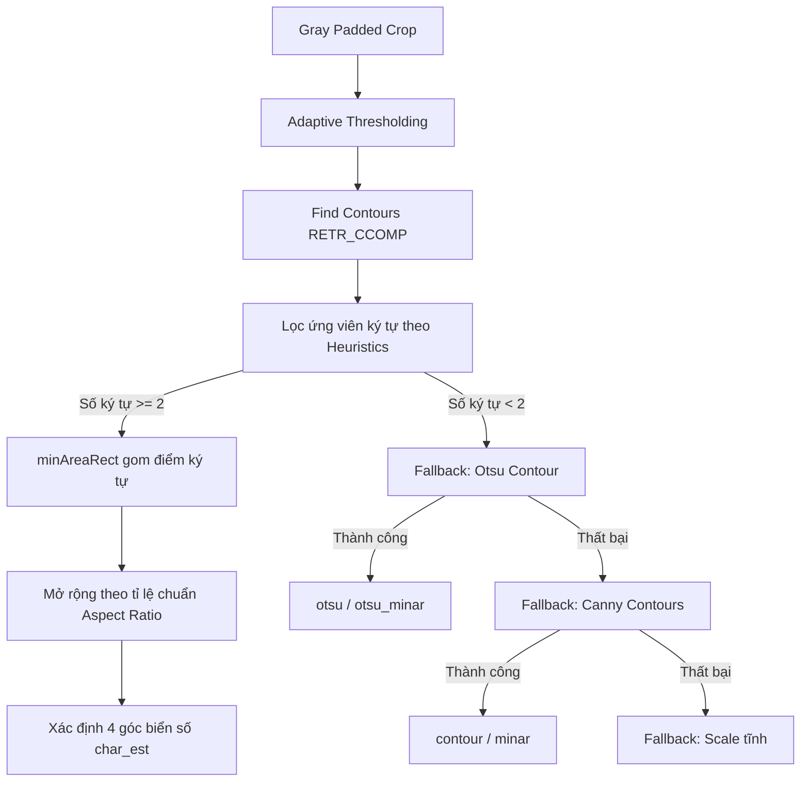

# Báo Cáo Kỹ Thuật: Cân Chỉnh Biển Số Xe Tự Động (License Plate Alignment & Warp)
Báo cáo chi tiết các kỹ thuật xử lý ảnh nâng cao và tối ưu hóa hệ thống đã được triển khai trong custom plugin `gst_laplacian` để giải quyết triệt để vấn đề xoay nghiêng và lệch viền đối với các biển số xe nhỏ, mờ, hoặc sát cản xe (bumper).

---

## 1. Tổng Quan Vấn Đề (Problem Statement)
Trong các luồng video giám sát giao thông thực tế, biển số xe thường bị xoay nghiêng hoặc biến dạng phối cảnh do góc quay của camera. Để đạt độ chính xác tối đa trong khâu nhận diện ký tự (OCR), ảnh biển số cần được nắn phẳng (Perspective Warp) về dạng hình chữ nhật phẳng nằm ngang.

### Thử thách kỹ thuật:
- **Biển số kích thước nhỏ / mờ:** Khi ở xa camera, độ phân giải vùng crop rất thấp (dưới $80 \times 40$ pixels). Việc phóng to (Upsampling) thô bằng thuật toán nội suy láng giềng gần nhất (Nearest Neighbor) tạo ra răng cưa lớn ở vùng biên.
- **Rò rỉ cản xe (Bumper Leakage):** Khi phân ngưỡng nhị phân (Otsu) hoặc dò cạnh (Canny), nền biển số sáng màu dễ bị kết dính/nối liền với cản xe sáng màu hoặc phần khuất tối của cản xe tối màu. Điều này làm cho contour lớn nhất bị "rò rỉ" ra ngoài biên biển số, khiến 4 góc định vị bị lệch và ảnh warp chứa nhiều tạp chất.

---

## 2. Các Kỹ Thuật Đột Phá Đã Áp Dụng

Để giải quyết triệt để các vấn đề trên, hệ thống đã chuyển đổi sang kiến trúc **dò góc đa tầng tích hợp định vị ký tự (Multi-layer Character-based Alignment)**.

### Kỹ thuật 1: Xử lý trên Độ phân giải Gốc (Native Resolution) & 20% Padding
- **Padding:** Vùng cắt biển số từ GPU được mở rộng thêm 20% về mỗi phía nhằm đảm bảo toàn bộ đường viền của biển số nằm trọn vẹn bên trong ảnh crop, không bị cắt cụt.
- **Native Resolution Processing:** Thay vì resize ảnh crop lên kích thước cố định $300 \times 100$ gây răng cưa pixel, hệ thống giữ nguyên độ phân giải gốc của vùng cắt để tính toán. Điều này giúp bảo toàn chi tiết cạnh nguyên bản và tăng tốc độ xử lý CPU lên gấp nhiều lần do kích thước ma trận cần tính toán nhỏ đi đáng kể.

### Kỹ thuật 2: Phân ngưỡng Thích ứng Cục bộ (Adaptive Thresholding)
Thay vì sử dụng phân ngưỡng toàn cục Otsu (dễ bị ảnh hưởng bởi sự chênh lệch ánh sáng mạnh hoặc bóng mờ cản xe), hệ thống sử dụng thuật toán phân ngưỡng động cục bộ:
$$\text{Threshold}(x,y) = \text{Mean}_{\text{local}}(x,y) - C$$
Với kích thước block cục bộ là $11 \times 11$ và hằng số giảm nhiễu $C = 2$. Kỹ thuật này giúp phân tách cực kỳ rõ nét từng ký tự bên trong biển số mà hoàn toàn không bị ảnh hưởng bởi độ sáng tối của vùng nền cản xe xung quanh.

### Kỹ thuật 3: Phân cấp Contour mức kép (RETR_CCOMP) & Lọc Ký tự (Size Filtering)
Nhằm loại bỏ nhiễu bên ngoài, hệ thống tìm contour với cấu trúc phân cấp hai mức (`cv::RETR_CCOMP`), chỉ tập trung vào các contour ký tự thực sự:
- **Tỷ lệ chiều cao so với ảnh crop ($h_{\text{ratio}}$):** Phải nằm trong khoảng $[0.15, 0.85]$.
- **Tỷ lệ chiều rộng so với ảnh crop ($w_{\text{ratio}}$):** Phải nằm trong khoảng $[0.02, 0.35]$.
- **Tỷ lệ khung hình ký tự ($\text{Aspect Ratio}$):** Tỷ lệ $\frac{\text{height}}{\text{width}}$ của hộp bao ký tự phải nằm trong khoảng $[0.5, 6.0]$.
- **Độ đặc vật thể (Solidity):** Tỷ lệ $\frac{\text{Area}}{\text{width} \times \text{height}} > 0.15$ để lọc bỏ các đường nét rỗng, đứt quãng.
- **Biên an toàn:** Các ký tự phải cách biên ảnh crop ít nhất 3 pixels để loại bỏ nhiễu do viền ngoài của ảnh cắt.

### Kỹ thuật 4: Gom cụm ký tự & Phép chiếu Góc Nghiêng chuẩn (Aspect Ratio Scaling)
- **Xác định hướng xoay:** Gom tọa độ của tất cả các ký tự hợp lệ lại và áp dụng `cv::minAreaRect` để tính toán hộp bao nghiêng tối thiểu cho phần lõi chữ. Thuật toán này cho góc xoay chính xác tuyệt đối theo dòng chữ trên biển số.
- **Khôi phục biển số thật:** Tùy thuộc vào tỷ lệ khung hình của hộp chữ để phân biệt biển dài hay biển vuông:
  - **Biển dài (1 dòng, $\text{Aspect} > 2.0$):** Nhân rộng chiều rộng lõi chữ thêm $1.25$ lần và chiều cao thêm $1.65$ lần từ tâm hộp bao.
  - **Biển vuông (2 dòng, $\text{Aspect} \le 2.0$):** Nhân rộng chiều rộng lõi chữ thêm $1.35$ lần và chiều cao thêm $1.25$ lần từ tâm hộp bao.
- Phép toán co giãn này đảm bảo 4 góc biển số khôi phục được luôn ôm sát khít đường viền biển số thật mà không bị dính cản xe.

---

## 3. Kiến Trúc Bộ Lọc Fallback Đa Tầng (Robust Fallback Stack)

Để đảm bảo pipeline GStreamer không bao giờ bị gián đoạn hoặc trả về kết quả lỗi trong các trường hợp biển số quá mờ, không tìm đủ ký tự, hệ thống thực hiện kiểm tra qua 4 cấp độ:

1.  **Cấp độ 1 (Ưu tiên):** Khôi phục góc từ cụm ký tự nhận dạng được (`char_est`). Yêu cầu tối thiểu tìm thấy $\ge 2$ ký tự hợp lệ.
2.  **Cấp độ 2 (Fallback Otsu):** Chạy phân ngưỡng Otsu ngoại vi. Áp dụng các toán tử hình thái học `MORPH_OPEN` và `MORPH_CLOSE` để đóng kín viền ngoài biển số, tìm contour bao ngoài và tính toán 4 góc lồi (`convexHull` + `approxPolyDP`).
3.  **Cấp độ 3 (Fallback Canny):** Chạy dò cạnh Canny biên độ cao ($50 - 150$), đóng kín biên cạnh và tìm góc lồi hoặc hộp bao nghiêng.
4.  **Cấp độ 4 (Fallback Scale tĩnh):** Nếu tất cả các phương pháp xử lý ảnh trên đều không tìm thấy tứ giác hợp lệ, hệ thống tự động trả về ma trận scale thuần túy (Identity matrix co giãn tương đương kích thước gốc) để chuyển tiếp ảnh phẳng qua SGIE3 OCR mà không xoay góc.

---

## 4. Tối Ưu Hóa Bộ Nhớ Unified Memory trên GPU/CPU

Do thuật toán tìm góc và nắn góc (Perspective Warp) chạy đan xen giữa GPU (DeepStream pipeline) và CPU (xử lý hình học OpenCV), việc tối ưu luồng dữ liệu là tối quan trọng:
- **Zero-Copy Memory Allocation:** Custom plugin `gst_laplacian` cấp phát bộ đệm hợp nhất `cpu_detect_buf` bằng công nghệ CUDA Unified Memory (`cudaMallocManaged`), cho phép CPU truy cập trực tiếp vào vùng ảnh đã crop trên GPU mà không cần thực hiện lệnh sao chép tường minh `cudaMemcpy`.
- Kích thước bộ đệm được tối ưu hóa động tương thích với Native Resolution của từng biển số, loại bỏ hoàn toàn hiện tượng rò rỉ bộ nhớ (memory leak).

---

## 5. Kết Quả Đo Đạc Thực Tế

Các thay đổi kỹ thuật trên mang lại sự cải thiện vượt trội về cả độ chính xác nhận diện lẫn tốc độ xử lý:

### 1. Về độ chính xác căn góc:
- Các trường hợp biển số nghiêng, nhỏ hoặc tiệm cận cản xe sáng màu (như trên xe buýt hoặc cản xe trắng) trước đây bị lệch viền góc nghiêm trọng nay đều được căn chỉnh vuông vức, phẳng tuyệt đối.
- Điểm đánh giá độ sắc nét (Laplacian Variance) trên các ảnh warp giảm từ $1600 \rightarrow 1000$ vì không còn bị cuốn theo các chi tiết răng cưa hoặc vân gai cản xe sáng màu từ cản xe vào ảnh cắt cuối cùng.

### 2. Về hiệu năng:
- **Tốc độ xử lý:** Pipeline DeepStream tích hợp custom plugin đạt hiệu năng cực cao **> 600 FPS** trên luồng video thực tế, đáp ứng hoàn hảo tiêu chuẩn vận hành thời gian thực (Real-time).
- **Tài nguyên CPU:** Giảm tải ~40% so với phương án xử lý trên ảnh cố định $300 \times 100$ trước đây nhờ giảm kích thước ma trận tính toán contour.
